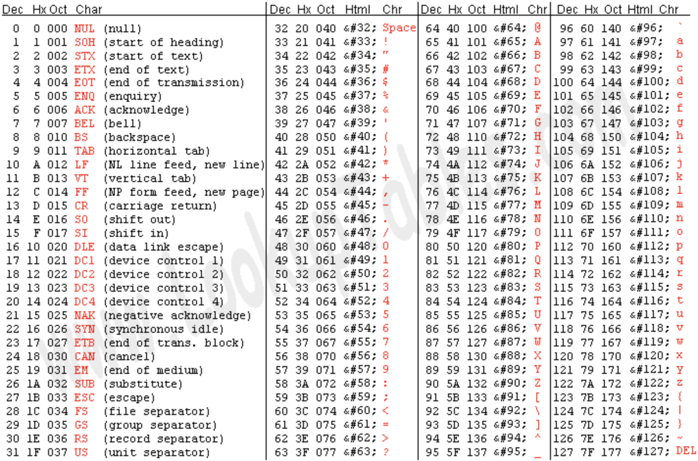
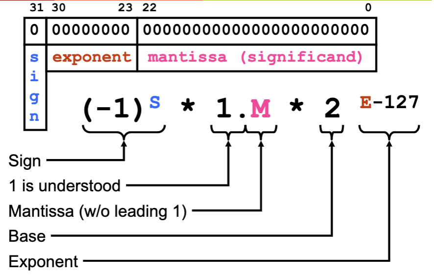
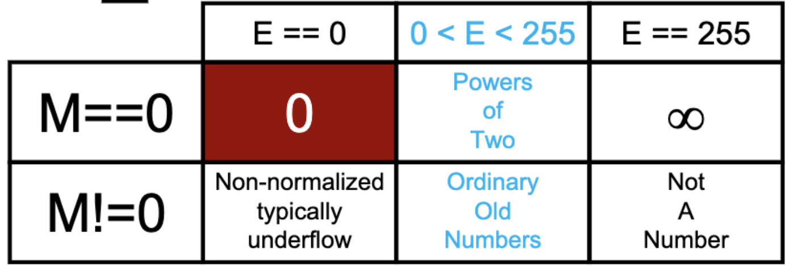
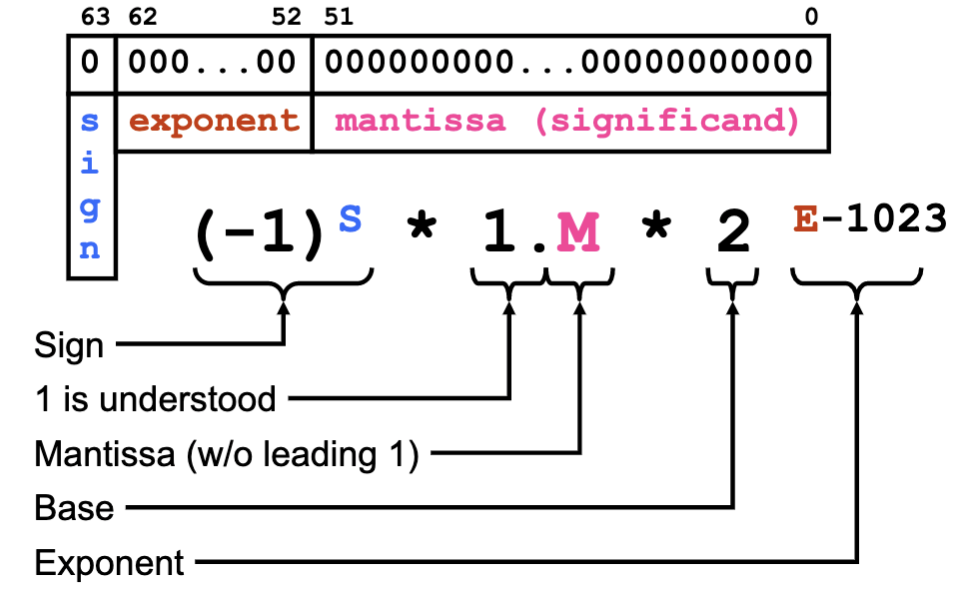

# Logical Operations On Bits
## Bitwise AND
| A    | B    | A AND B |
| ---- | ---- | ------- |
| 0    | 0    | 0       |
| 0    | 1    | 0       |
| 1    | 0    | 0       |
| 1    | 1    | 1       |

## Bitwise OR
| A    | B    | A OR B |
| ---- | ---- | ------ |
| 0    | 0    | 0      |
| 0    | 1    | 1      |
| 1    | 0    | 1      |
| 1    | 1    | 1      |

## Bitwise NOT
| A    | NOT A |
| ---- | ----- |
| 0    | 1     |
| 1    | 0     |

# Bitwise XOR
| A    | B    | A XOR B |
| ---- | ---- | ------- |
| 0    | 0    | 0       |
| 0    | 1    | 1       |
| 1    | 0    | 1       |
| 1    | 1    | 0       |

## Bitwise NAND
| A    | B    | A NAND B |
| ---- | ---- | -------- |
| 0    | 0    | 1        |
| 0    | 1    | 1        |
| 1    | 0    | 1        |
| 1    | 1    | 0        |

## Bitwise NOR
| A    | B    | A NOR B |
| ---- | ---- | ------- |
| 0    | 0    | 1       |
| 0    | 1    | 0       |
| 1    | 0    | 0       |
| 1    | 1    | 0       |

- there are  two-argument boolean functions have maximum

## Left-Shift
```
0111 << 10 (base 2) = 7 << 2 (base 10)
-------------------
BEFORE: 0111
 AFTER: 1100
```
-  multiplies `x` by 
    - `n` must be 

## Right-Shift
```
0111 >> 10 (base 2) = 7 >> 2 (base 10)
-------------------
BEFORE: 0111
 AFTER: 0001
```
-  divides `x` by 
    - `n` must be 
- Note: the rule of dividing doesn't work all the time
    - **logical right-shift**: shifts all the bits of its operands, but does not preserve a number's sign
        - ex. 10010111 >> 1 == 01001011
    - **arithmetic right-shift**: shifts all the bits of its operands, but the left most bit is replicated to fill positions that are emptied
        - ex. 10010111 >> 1 == **1**1001011
        - ex. 00010111 >> 1 == *0*0001011

# Other Representations
## Bit-Vectors
- 1 byte = 8 bits
- in a bit-vector, every bit is 1 boolean
- Note: by convention bit-zero starts on the right

```
bit index  |    7   6   5   4   3   2   1   0
----------------------------------------------
bit-vector |    0   0   1   0   0   1   0   0
```

### Manipulating Bit-Vectors
- often we use a constant (aka mask) with a boolean function to manipulate
- when using masks, use the ~ version of the mask
- clear:: identity:  & 
    	- put a zero in any bit you want to clear
    	-  & 
- set:: identity:  | 
    - put a 1 in any bit you want to set
    -  | 
- toggle:: identity:  ^ 
    - put a 1 in any bit you want to toggle
    -  ^ 
- to test a bit, clear all the rest
    -  & 
    - now you can test 
- to put a 1 in any bit position n, shift left by n
    -  
- to put a 0 in any position, put a 1 in that position and complement
    - ~
    - creates as many leading ones as you need

## Hexadecimal And Octal
- binary -> octal
	- convert groups of 3 binary bit into 1 octal digit
- octal -> binary
	- convert each octal digit into a 3 digit binary bit
-  binary -> hexadecimal
	- convert groups of 4 binary bit into 1 hexadecimal digit
- hexadecimal -> binary
	- convert each hexadecimal digit into a 4 digit binary bit

- in Java and C
	- 456 is decimal
	- 0456 is octal
	- 0x456 is hexadecimal

|A|B|C|D|E|F|
|-|-|-|-|-|-|
|10|11|12|13|14|15|

## ASCII (American Standard Code for Information Interchange)


- ASCII was designed so that masks could be used to relate certain characters
	- lower-case to/from upper case letters -> flip bit 5
	- and many more...

## Floating Point (IEEE-754)
- floating point: $<sign>\ <1.number> \times <base>^{<exponent-127>}$
		- ex. $-6.023 \times 10^{-23}$
- non-normalized floating point: $<sign>\ <0.number> \times <base>^{<exponent-126>}$



- but we can't represent zero...
- below are the corner cases...



|decimal|floating point|
|-|-|
|0|0 00000000 0000000000000000000000|
|-0|1 00000000 0000000000000000000000|
||0 11111111 0000000000000000000000|
||1 11111111 0000000000000000000000|
|NaN|1 11111111 0000001000000000000000|
|NaN|1 11111111 1010000010000010000100|

### Not A Number (NaN)
- suppose A is a floating point number set to NaN
	- A != B is true, when B is another floating point number (NaN, infinity, or anything)
	- A != A is true (meaning A is not equal to itself)
- if A or B is NaN, the following are all false
	- A < B
	- A > B
	- A == B

### Casting Int To Float
- int has 32 significant digits, float has 24 significant digits
	- conversions from int to float won't be exact

## Double (IEEE-754)

- same as floating point, just different number of bits

### Casting Int To Double
- int has 32 significant digits, double has 64 significant digits
	- conversions from int to double will be exact

### Comparing Two Floating Point Numbers
- if either is NaN, the comparison is defined as "unordered" (all comparisons to it except for != are false)
	- NaN != Nan is true
	- NaN != infinity is true
	- NaN != infinity is true
	- if A or B is NaN:
		- A = B is false
		- A > B is false
		- A < B is false
- if either is -0.0, replace with 0.0
- if signs are different, positive number is greater
- compare the rest of the bits as integers
	- treat bits 0-31 (all except for signed bit) as an unsigned integer and compare as if they are integers
- if signs are both negative, reverse the comparison