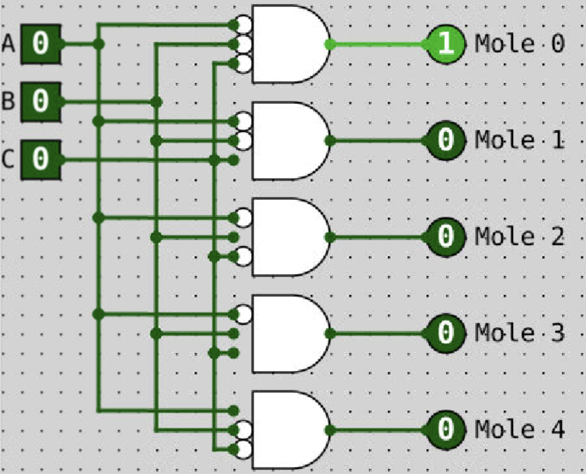

# Complementary Transistors
- n-Type MOS
	- switch is normally open
	- applying current closes the switch
- p-Type MOS
	- switch is normally closed
	- applying current opens the switch

- a wire with some designated voltage (ex. +9.0V) can represent a logical 1
- a wire with some designated voltage (ex. 0V or ground) can represent a logical 0
- a wire that is not connected to 9.0V or ground is in a floating or high impedance state (value randomly varies from 0 to 1)

# Logic Gates
## De Morgan's Law
- (A' & B')' = A | B
- (A' | B')' = A & B

##  Conte Bubble Theorem

- flip gates (OR -> AND, AND -> OR)
- flip inputs and outputs by adding or removing a bubble (NOT)

## Larger Gates

- (AB)(CD) is faster than (A(B(CD)))

# Combinational Logic
- a combination of AND, OR, NOT (plus NAND and NOR)
- Note: the same inputs produce the same output

## Decoder
- will turn on at most 1 output, based on which input bits are set
- `n` input bits will produce   outputs for a decoder
- fewer inputs than outputs

## Multiplexor (MUX)
- a multiplexor has:
	-  inputs
	- `n` selector bits (aka control inputs)
	- 1 output
- selects between inputs using a selector
- more inputs than outputs

- bubble = 0
- wire = 1
- each gate of the decoder is "represented" by a binary number using bubbles and wires

## Demultiplexor (DEMUX)
- sends the input across exactly one of the output lines
- other outputs remain 0
- a demultiplexor has:
	-  ouptuts
	- `n` selector bits
	- 1 input
- more outputs than inputs

## Simple Adder
- sum -> use XOR gate

## Half-Adder
- sum -> use A XOR B
- carry out -> use A AND B

## Full-Adder
- add carry-in bits

# Simplification
## Boolean Simplification

## Classic Sequence vs. Gray Code Sequence
- gray code sequence never has two switches changing at the same time

|Classic Sequence|Gray Code Sequence|
|-|-|
|000|000|
|001|001|
|010|011|
|011|010|
|100|110|
|101|111|
|110|101|
|111|100|

- gray code also allows you to loop around from the end to beginning (100 -> 000)

## Karnaugh Map
- a method of simplifying boolean expressions by grouping together related terms
	- two adjacent 1's in the map means there is a `x+x'` in the formula
- results in the simplest sum-of-products expression possible
- allows for "don't care" outputs

|A|B|C|func(A,B,C)|
|-|-|-|-|
|0|0|0|X|
|0|0|1|0|
|0|1|0|0|
|0|1|1|1|
|1|0|0|1|
|1|0|1|1|
|1|1|0|0|
|1|1|1|1|

1. Create the K-Map
	- using a truth table distribute variables across rows and columns using gray code order
	- fill in corresponding entries

|.|AB|AB'|A'B'|A'B|
|-|-|-|-|-|
|**C**|1|1|0|1|
|**C'**|0|1|X|0|

2. Make groupings
	- grouping rules
		- groups must be rectangular (may wrap around edges!)
		- groups may only contain 1s or Xs
		- all 1s must be contained within at least one group
		- groups must be as large as possible
		- the size of a group must be a power of 2
		- overlaps are allowed

|.|AB|AB'|A'B'|A'B|
|-|-|-|-|-|
|**C**|1*|1**|0|1*|
|**C'**|0|1**|X|0|

`*` denotes one group
`**` denotes another group

3.  Write the simplified equation
	- pull out the simplified expression based on K-Map groupings
		- (ABC + A'BC) + (AB'C + AB'C')
		- BC + AB'

## Programmable Logic Array/(Field) Programmable Gate Array (PLA/PGA/FPGA)
- given a truth table, we can implement its outputs using a series of NOT gates, AND gates, and then OR gates
- we need  AND gates where `n` is the number of inputs
- we need 1 OR gate for each output
- PLA/PGA/FPGA devices exist for this reason