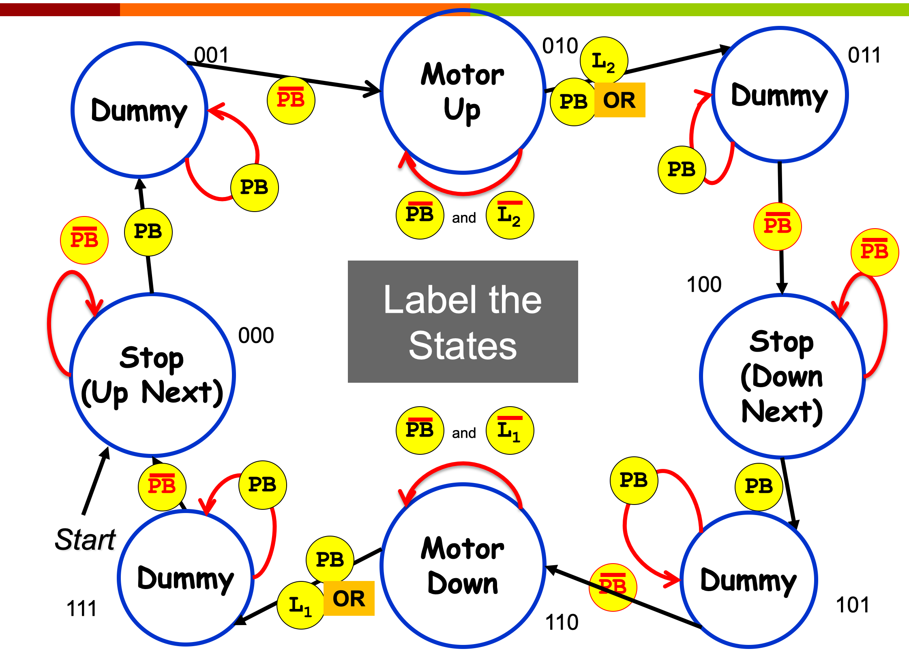

# Combinational vs. Sequential Logic
- combinational
	- combination of AND, OR, NOT (plus NAND & NOR)
	- same inputs always produce the same output
	- analogous to a cheap bicycle lock

- sequential
	- requires storage elements
	- output depends on inputs plus the state
	- analogous to a RLR combination lock
	- used to build memory and state machines

# Basic Storage
- composed of 2 NOT transistors

## R/S Latch
- stores a bit

## Gated D Latch
- when write enable (WE) is turned on, changes in the D latch is recorded on the R/S latch
- **level-triggered device**: it will store whatever value is present on the input when the write enable goes from true to false

# Register
- an array of gated D latches

# Definitions
- **address space**: the number of memory addresses that exist (how many addresses are possible?)
	- an n-bit address line can represent  memory addresses
	- ex. If you have a memory with a 16-bit address in which each byte is given a distinct memory address, what is this memory’s address space?
		- 
- **addressability**: the amount of data stored at any given memory address (how big is each memory location?)
	- ex. If you have a memory with a 16-bit address in which each byte is given a distinct memory address, what is the addressability of this memory?
		- 8 bits (because 8 bits, per byte)
	- ex. What is the addressability of a system with 16 KiB (16384 bytes) of memory, composed of 2048 memory addresses?
		- 8 bytes (16384 / 2048) or 64 bits
- addressability  address space = amount of storage

# Edge-Triggered And Level-Triggered Flip-Flops
## Level-Triggered Logic
- in level-triggered logic, the output can only change when the enable bit is 1
- when the enable bit is set to 0, then the output is unaffected by changes in the input
- ex. RS-latches and gated D-latches

## Edge-Triggered Logic
- many sequential logic circuits are based on clocks instead of enable bits
- **rising-edge triggered logic**: The output can only change when the clock changes from 0 to 1
- **falling-edge triggered logic**: The output can only change when the clock changes from 1 to 0
- ex. d-flip flop, register, state machine

## D-Flip Flop
- D-flip flops consist of 2 gated D-latches
- rising-edge triggered
- the left D-latch updates when the clock is 0, and the right D-latch updates when it is 1

## Clock Edges

- the problem with level-triggered devices in sequential circuits is that the output of the device is used in computing the input to the same device
	- aka we don't know when to stop
- as a result, we use the leader-follower flip flop with 2 gated D latches

## Clock Edges And Leader-Follower
- edge-triggered device

# State Machine
- at any point, we are in one state, which defines our current outputs
- even a simple computer represents a very complex state machine
	- a processor is always doing one of many things
	- there are lots of inputs (keyboard, mouse, power button, etc.)
- state machines are clock driven
	- the state is always updated once per clock cycle, even if you transition into the same state
	- this is true of all sequential logic in modern computers

## Finite State Machine (FSM) Diagram
- used to describe control logic

## Drawing An FSM Diagram
1. Decide how we will encode our states.
	- a binary number will always work
2. Draw a state diagram including:
	- labeled states (encoding)
	- outputs during the state
	- arcs with conditions for state changes
3. Create truth tables with:
	- inputs: circuit inputs and current state
	- output: circuit outputs and next state
	- fill in the outputs for all combinations based on the state diagram.
4. Implement a combinational circuit for each output using the truth table.

## State Machine For A Garage Door Opener

- the purpose of the dummy is to prevent "pressing and holding the button" from breaking our machine
	- the button must be released before it is possible to go to the next state

- 
-  +  + 
-  +  +  + 
- 
- 

## Two Kinds Of State Machines
1. one hot
	- one bit per state
	- only one bit is on at a time
	- faster
	- requires more flip flops
	- states progress 00001 >> 00010 >> 00100 >> 01000 >> 10000
2. binary encoded
	- encode state as a binary number
	- use a decoder to generate a line for each state
	- slower
	- more complicated
	- states progress
	- 000 >> 001 >> 010 > 011 >> 100