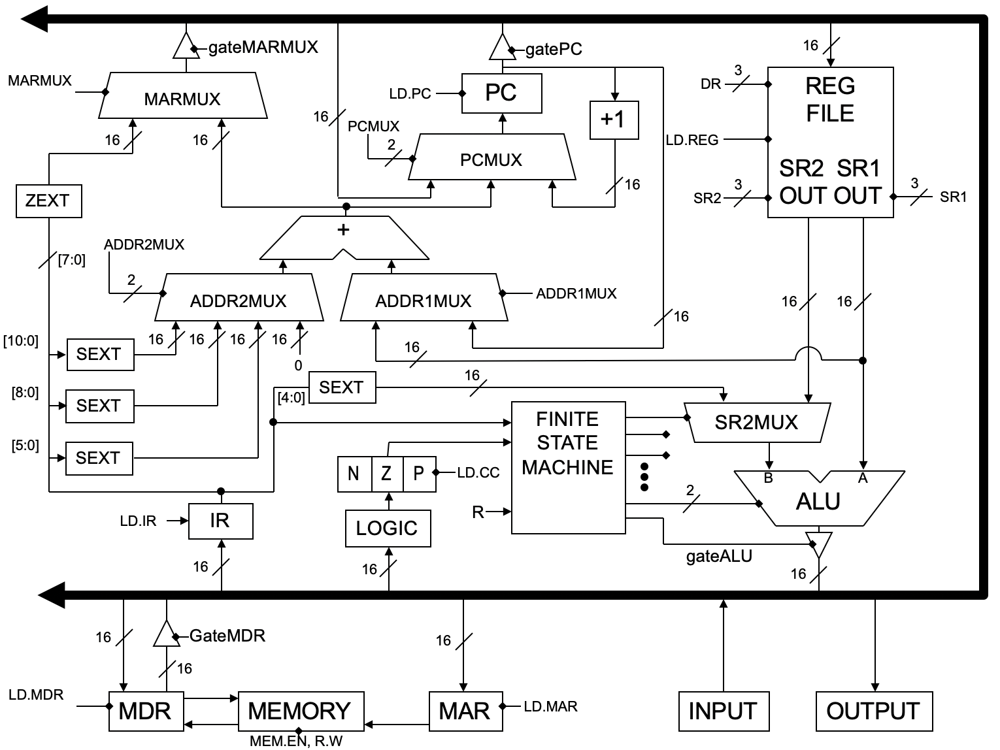
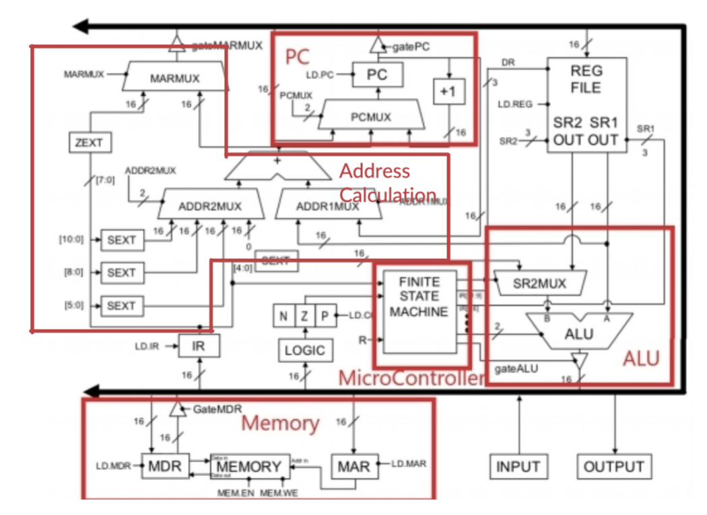
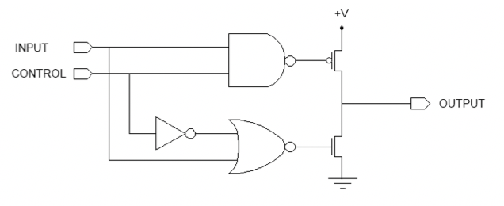
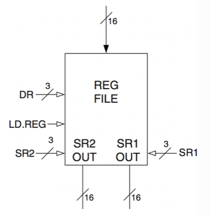
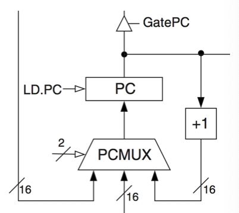
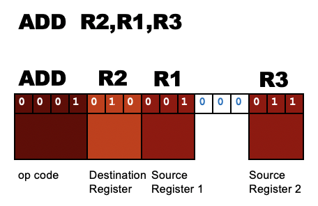

# The Idea
- the central idea in the Von Neumann model of computer processing is that the **program** and **data** are both **stored** as sequences of bits in the **computer's memory**
	- the program is executed, one instruction at a time, under the direction of the control unit
- the Von Neumann model leads us to treat machine instructions as just another data representation
- what can be stored in memory?
	- data
	- instructions

# The LC-3 CPU
- address space: 
- addressability: 16 bits
- architecture type: Von Neumann
- general purpose registers: 8
- instruction size: 16 bits

## LC-3 Components

- the LC-3 CPU is just a combination of
	- MUX
	- STATE (FSM, IR, PC, NZP, LOGIC, MEMORY, REG FILE)
	- COMPUTE (ALU)
	- MEMORY
	- CONTROL (FSM, IR, PC, NZP, LOGIC)
	- TRI-STATE BUFFER

## The Bus
- **bus**: 16-bit wire that transfers data between many components
- only one value is allowed on the bus at a time to prevent short circuits

## Tri-State Buffer
- helps in making sure there is only one value on bus
- allows us to choose whether or not to write a value
- has no transistors or logic, just wires to connect things
- are used to disconnect inputs so the bus can be shared among multiple components
- there is exactly 1 true output for a tri-state buffer to prevent data path fires and short circuits

|control|input|output|
|-|-|-|
|0|0|Z|
|0|1|Z|
|1|0|0|
|1|1|1|

NOTE: Z means floating/hanging output

## Control Signals
- used to move data around
- LD.___
	- write enable for a register
- gate___
	- tri-state buffer that allows data to go onto the bus
- ___MUX
	- selector for a multiplexer

## Control Signals Example
- ex. if we want to put data from the PC (a register) into the MAR (a register), what signals do we turn on?
	- gatePC to move data from PC to the bus
	- LD.MAR to enable writing onto the MAR

## Clock
- clock cycles alternate between 0 and 1
- 1 clock is connected to all the registers, keeping them in sync
	- prevents short circuits
	- when a register has its write-enable on, the next clock edge saves its current input

## Microcontroller
- is a FSM
- every instruction has a series of states to execute it
- each state has:
	- set of outputs (control signals like ALUK, LdReg, etc.)
	- the next state to go to
- ensures that correct operations take place while preventing short circuits

## ALU
- two inputs:
	- SR1: data from register
	- SR2: data from register or immediate value from the instruction
- selector bits come from FSM
	- 00 → A + B
	- 01 → A AND B
	- 10 → NOT A
	- 11 → PASS A
- drives output onto bus
- condition codes (CC)
	- set when writing to general purpose registers, LD.CC flag
	- only three possible states: 001, 010, 100

## What Is Memory? Registers VS. Memory (RAM)
- **registers**: used for quick data storage on the processor
- **memory (RAM)**: like a really big array containing instructions for programs that are currently being executed; stores any data a program may need
- two sides of memory: address and data

## Memory Layout Example
|Addresses|Data At Address|
|-|-|
|0x3000|ADD R1,R2,R0|
|0x3001|HALT|
|0x3002|0b0010000100010000|
|0x3003|0x2110|
|...|...|
|0x300A|#8464|

## Register File Circuit
- a small, fast "memory"
	- address space: 8 registers
	- 16-bit addressability per register
- 2 outputs
	- dual-ported memory
	- can read two registers at the same time
	- SR1 (3-bit address)
	- SR2 (3-bit address)
- 1 input
	- DR (3-bit address)
	- LD.REG (write enable)
- can read two registers and write one register in a single clock cycle

## Program Counter (PC)
- **program counter (PC)**: register holds the address of the next instruction to be executed
	- DOES NOT HOLD the current instruction or address of the current instruction

- PCMUX (2-bit MUX selector)
	- adder to increment PC by 1 (PC + 1)
	- data from bus to PC
	- data from effective address calculator to PC (PC + offset)
- LD.PC (write enable)
	- write enable for PC register
- gatePC (tri-state buffer)
	- put PC value on bus
- PC circuit uses 4 bits of control signals

## Instruction Register
- **instruction register (IR)**: holds the value of the instruction currently being executed
- having the correct value in the IR helps the FSM determine the current state and send correct control signals

# Machine Instructions
- **machine instruction**: just another data representation telling the processor what to do

## Categories Of Machine Instructions
- operate (ALU)
	- ADD
	- AND
	- NOT
- data movement (memory)
	- load
		- LD
		- LDR
		- LDI
		- LEA
	- store
		- ST
		- STR
		- STI
- control
	- BR
	- JMP
	- JSR
	- JSRR
	- RET
	- RTI
	- TRAP

## Instruction Example

- means R2=R1+R3

## How Do We Make LC-3 Do An "ADD"?
- LC-3 is controlled by a large finite state machine so it has output signals (control signals)
- the FSM turns on specific control signals in the LC-3
	- activates certain paths in the datapath, making it do certain things
- before FSM could execute ADD, it had to fetch the instruction from the memory
- the FSM has a procedure that executes over-and-over to process instructions
	- FETCH
	- DECODE
	- EXECUTE
- the FSM fetches and decodes each instruction before it executes it

## What Is A Machine Code Program?
- **machine code program**: a series of machine code instructions that is a 16-bit data value
- the instructions are stored in memory (usually in sequence, consecutive memory locations)
- each memory location has an address that is a 16-bit unsigned integer

# Instruction Cycle
## FETCH And DECODE
- FETCH, FETCH, FETCH (3 clock cycles)
	- load the next instruction from memory into the instruction register
	- increment the PC
- DECODE (1 clock cycle)
	- the microcontroller looks at the instruction to figure out how to execute it
- 4 clock cycles are used to fetch and decode an instruction
	- happens at the beginning of every machine code instruction

## Instruction Processing: FETCH
- load next instruction (at the address stored in PC) from memory into instruction register (IR)
	- copy contents of PC to MAR (memory address register)
	- send "read" signal to the memory
	- copy contents of MDR (memory data register) into IR
- increment PC, so that it points to the next instruction in the sequence
	- PC becomes PC + 1

## Instruction Processing: DECODE
- first identify the opcode
	- on the LC-3, this is 4 bits (15:12)
	- the FSM chooses a next state corresponding to the desired opcode
- depending on opcode, identify other operands from the remaining bits
	- ex. for LDR, last six bits is offset
	- ex. for ADD, last three bits is source operand
- DECODE is the FSM!
	- it activates the control signals in the datapath

## Instruction Processing: EXECUTE
- perform the operation, using the source operands
	- ex. send operands to ALU and assert ADD control signal
	- ex. do nothing (for loads and stores to memory)
- what EXECUTE operation does depend on...
	- every instruction has a different execute phase
	- with different control signals
- but every instruction starts with
	- FETCH, FETCH, FETCH, DECODE

## Instruction Processing Review
- instruction bits look just like data bits in memory – it’s all a matter of our interpretation
- three basic kinds of instructions
	- computational instructions (ADD, AND, NOT)
	- data movement instructions (LD, ST, ...)
	- control instructions (JMP, BRnz, ...)
- six basic phases of instruction processing
	- F -> D -> EA -> OP -> EX -> S -> repeat
	- not all phases are needed by every instruction
	- phases may take variable number of machine cycles (states)

# LC-3 Is A FSM
- has 64 possible states
- orchestrates 42 control signals
	- multiplexor selectors (PCMUX, MARMUX, ADDR2MUX, ...)
	- tri-state buffer enables (gatePC, gateMARMUX, gateALU, ...)
	- register write-enables (LD.PC, LD.REG, LD.MAR, LD.CC, ...)
	- other control signals (ALUK, MEM.EN, R.W, ...)
- the wires aren’t all shown explicitly on the datapath diagram to avoid clutter, but each signal has a name

# How Do We Implement The LC-3 State Machine?
- just like the garage door opener, we build logic to produce output control signals
- the garage door had 2 output signals: UP and DOWN
- the LC-3 has 42 control signals
	- these signals control the datapath (the MUX selectors, tri-state buffers, write enables (e.g LD.REG), etc
	- the output of the FSM is the 42 control signals
- the LC-3 is a glorified state machine
	- but works just like the garage door opener
	- it has 64 states and 42 control signal outputs