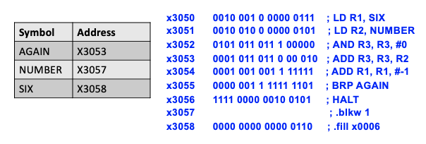
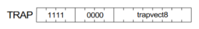

# Assembly Language
- low-level language
- dependent on instruction set architecture (ISA)
- typically each instruction line in assembly language produces a single machine instruction
- contrasts with high-level languages
	- FORTRAN, C, etc.
	- typically converted to assembly
- user friendly
	- mnemonics, not binary numbers
	- names for memory addresses and opcodes
- does a bit more than just the machine instructions

## Our Choices
- choices of approach
	- assembly language programming for experienced high-level language programmers
- choice of goal
	- a basic competency in assembly language for use as a tool in debugging, computer architecture, and optimization

## Example: Multiply By 6
```assembly
;multiply a number by 6

		.orig x3050
		LD R1, SIX		;R1 is a loop counter
		LD R2, NUMBER
		AND R3, R3, #0	;clear R3, will hold product
		
;do until R1 <= 0
AGAIN	ADD R3, R3, R2	;summing into R3
		ADD R1, R1, #-1	;decrement loop counter
		BRp AGAIN
		HALT

;
NUMBER .blkw 1
SIX .fill x0006
	.end
```

# Assembler Directives
- **assembler directives**: pseudo-ops that tell the assembler to do something other than assemble a machine instruction
- pseudo-ops
	- ```.orig x3000```
		- tells the assembler to put a block of code at the desired address (in this example, x3000)
	- ```.fill 1```
		- initialize one location
		- reserve and fill a word with a numeric value, optionally naming it (in this example, puts 1 in the current memory location)
	- ```.blkw n```
		- set aside n words in memory
		- reserve and optionally name the beginning of an area of memory
	- ```.stringz "sample"```
		- initialize 7 locations (one location for every letter in "sample" and a 0 word '\\0')
		- store an ASCII string in memory with a zero terminator, optionally naming it
	- ```.end```
		- end of assembly program or block

## Labels
- **tags/labels**: lets you assign names to memory addresses, even if they move around
- ex. `AGAIN` or `SIX`
- Note: tags/labels are optional

## Opcodes And Operands
- ex. `ADD R3, R3, R2`
- ex. `ADD R1, R1, #-1`

## Comments
- ex. `; Summing into R3`

## Number Bases
|Base|Denoting|
|-|-|
|decimal|#|
|binary|b|
|hexadecimal|x|

- ex. `#-1` or `b1101` or `x3050`

# What Gets Assembled (What Complx Shows)
|memory address|hex|dec|symbol/label|instruction|
|-|-|-|-|-|
|3050|x2207|8711||`LD R1, SIX`|
|3051|x2405|9221||`LD R2, NUMBER`|
|3052|x56E0|22240||`ADD R3, R3, #0`|
|3053|x16C2|5826|AGAIN|`ADD R3, R3, R2`|
|3054|x127F|4735||`ADD R1, R1, #-1`|
|3055|x03FD|1021||`BRP AGAIN`|
|3056|xF025|-4059||`HALT`|
|3057|x0000|0|NUMBER|`NOP *`|
|3058|x0000|6|SIX|`NOP *`|

## Assembly File Layout
```assembly
.orig x3000
		LD	R1, B
		LD	R0, A
		HALT
A		.fill 2
ARRAY	.fill x6000
.end

.orig x6000
		.fill 1
		.fill 2
		.fill 3
.end
```
- the above code is laid out in the LC-3 like the following 

|Symbol/Label|Address|Value|
|-|-|-|
||x2FFE|don't know|
||x2FFF|don't know|
||x3000|`LD R1, B`|
||x3001|`LD R0, A`|
|A|x3002|`HALT`|
||x3003|`2`|
|ARRAY|x3004|`x6000`|
||x3005|don't know|
||||
||x5FFE|don't know|
||x5FFF|don't know|
||x6000|`1`|
||x6001|`2`|
||x6002|`3`|
||x6003|don't know|
||x6004|don't know|

# Common Assembly Techniques
- use a semicolon to write comments
- clearing a register
	- ex. clearing R1 ```AND R1, R1, 0```
- if-statements and while loops use BR statements to conditionally jump
	- ex. BRz will branch when condition codes are 0
	- Note: BR and BRnzp will branch unconditionally
- setting condition codes	
	- ex. ```ADD R1, R1, 0; R1=R1+0```
- subtraction/negation - use NOT (flip the bits) and ADD (add 1)
```assembly
NOT R3, R1		;R3=~R1
ADD R3, R3, 1	;R3=~R1+1=-R1
ADD R3, R2, R3	;R3=R2+(-R1)=R2-R1
```
- copy a value to another register
	- ```ADD R2, R1, 0	;R2=R1+0```

# The Assembly Process
- objective
	- translate the assembly language (AL) program into machine language (ML)
	- each AL instruction yields one ML instruction word
	- interpret pseudo-ops correctly
- problem
	- an instruction may reference a label
	- if the label hasn't been encountered yet, the assembler can't form the instruction word
- solution
	- two-pass assembly

## Two-Pass Assembly
- first pass - generating the symbol table
	- scan each line
	- keep track of current address (location counter)
		- increment by 1 for each instruction
		- adjust the location counter as required for any pseudo-ops (ex. ```.fill```, ```.blkw```, etc.)
	- for each label, enter it into the symbol table along with the current address (location counter)
	- stop when ```.end``` command is encountered
- second pass - generating the ML program
	- scan each line again
	- translate each AL instruction into ML
		- look up symbols in the symbol table
		- ensure that labels are no more than +256 / -255 lines from PCoffset9 instructions
		- calculate the operand field for the instruction
		- update the current address (location counter)
	- fill memory locations as directed by pseudo-ops
	- stop when ```.end``` is encountered



# Aliases: TRAP Pseudo-Instruction
- the assembler will recognize aliases for certain predefined TRAP instructions
- TRAPs are subroutines build into the LC-3 to simplify instructions
- look like normal instructions but are aliases for TRAP calls
	- ex. ```HALT``` is the same as ```TRAP x25```



|instruction|alias|action|
|-|-|-|
|TRAP x25|HALT|stops the CPU|
|TRAP x23|IN|input character from keyboard|
|TRAP x21|OUT|print character on screen|
|TRAP x22|PUTS|
|TRAP x24|PUTSP|
|TRAP x20|GETC|
|JMP R7|RET|