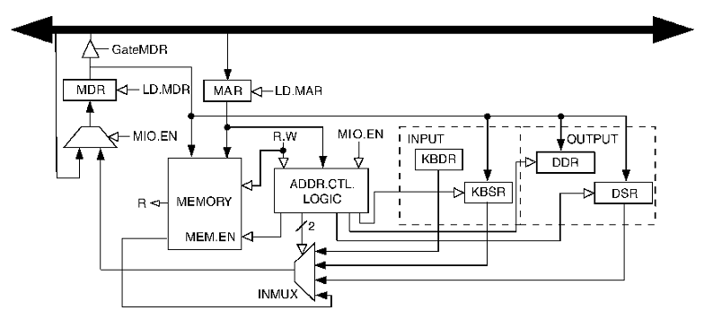

# I/O Basics
## Synchronicity
- asynchronous
	- electronic, mechanical, and human speed
	- speed mismatch
- synchronous
	- processor operation
	- certain kinds of high speed I/O

## Transfer Timing
- I/O events generally happen much more slowly than CPU cycles
- synchronous
	- data supplied at a fixed, predictable rate
	- CPU reads/writes every X cycles
- asynchronous
	- data rate less predictable
	- CPU must synchronize with device, so that it doesn't miss data or write too quickly

## Two Methods Of Doing I/O
- special I/O instructions
	- need an opcode
	- need to be general enough to work with devices that haven't been invented yet
- memory-mapped I/O
	- steal part of the address space for device registers
	- operations done by reading/writing bits in the device registers

## Device Registers
- **data register**: used for the actual transfer of data (ex. character code)
	- device registers are often part of the I/O device itself
- **status register**: information the device is telling us
- **control register**: allows us to set changeable device characteristics
- options
	- may be memory mapped (aka has a memory address)
	- may have special I/O instructions

## Memory Mapped vs. Special I/O Instructions
- if device registers are located at valid memory addresses, how can we access them?
	- interrupt-driven
	- polling

## Interrupt-Driven vs. Polling
- the two ways to handle I/O completion
- interrupt-driven
	- "excuse me, I have just given you a character"
- polling
	- "has a character been typed?"
	- "has a character been typed?"
	- "has a character been typed?"
	- "has a character been typed?"
	- "has a character been typed?"
	- "has a character been typed?"
	- ...

## LC-3 Address Space


- 512 device registers (, because 9 bits can be set)

# Keyboard Input


- KBSR (xFE00)
	- keyboard status register
	- only uses 1 bit (uses bit 15)
	- bit 15 is set when the character is available


- KBDR (xFE02)
	- keyboard data register
	- really only need 8 bits but 16 bit is easier
	- this location is read-only
	- reading clears KBSR
- there is also an interrupt enable bit not shown in KBSR to indicate we want to be interrupted when KBSR[15] is set to 1

## Example: Reading From The Keyboard
```assembly
; Read characters from the keyboard until CTRL/Z
		.orig x3000
		LD	R4, TERM
		LEA	R2, BUFFER	;initialize buffer pointer
START	LDI	R1, KBSRA	;see if a char is there
		BRzp	START
		LDI	R0, KBDRA	;get the character
		STR	R0, R2, #0	;store it in buffer
		not	R0, R0		;subtract R4-R0
		ADD	R0, R0, #1	;to check for termination
		ADD	R0, R0, R4	;char stored in R4
		BRz	QUIT
		ADD	R2, R2, #1	;increment buffer pointer
		BR	START		;repeat
QUIT	HALT


TERM	.fill   x001A	;CTRL/Z
KBSRA	.fill	xfe00
KBDRA	.fill	xfe02
BUFFER	.blkw	x0100
		.end
```

# Monitor Output


- DSR (xFE04)
	- display status register
	- transferring a character to DDR clears DSR
	- when the monitor is finished processing a character it sets DSR bit-15 (aka "please sir, may I have another")


- DDR (XFE06)
	- display data register
	- transfer character to this address to print it on the monitor

## Example : Writing To The Display
```assembly
; Write the contents of a string to the display
		.orig 	x3000
		LEA R2, BUFFER	;initialize buffer pointer
START	LDR	R0, R2, 0	;get char into R0
		BRz	QUIT		;terminate on null
WAIT	LDI	R3, DSRa	;are we ready?
		BRzp WAIT
		STI	R0, DDRa	;send R0 to monitor
		ADD	R2, R2, 1	;move buffer pointer over 1
		BR	START
QUIT	HALT

DSRa	.fill	xFE04
DDRa	.fill	xFE06
BUFFER	.stringz "Hello, World!"
		.end
```

# LC-3 Memory-Mapped I/O


- because of interrupt enable bits, status registers (KBSR/DSR) must be written as well as read

