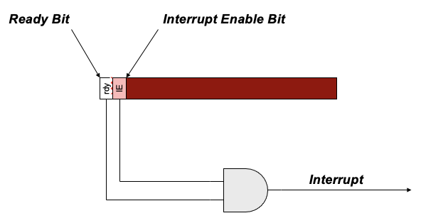
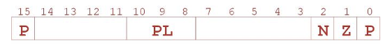
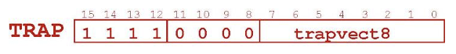
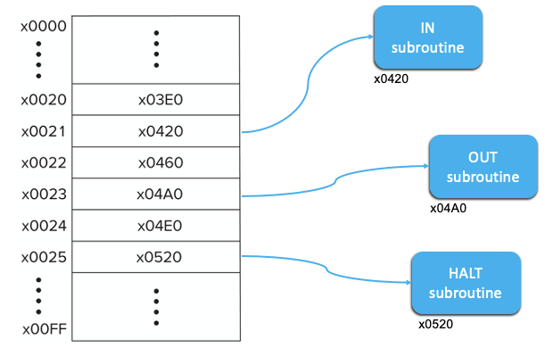

# Operating System Machine Layer
- operating systems are about sharing resources and protecting users from themselves and others
- certain operations require specialized knowledge and protection:
	- specific knowledge of I/O device registers and the sequence of operations needed to use them
	- I/O and memory resources shared among multiple users/programs (a mistake could affect lots of other users/processes)
- not every programmer knows this level of detail, so we abstract them in an operating system machine layer
- we transparently provide service to I/O devices and we notify user programs of unexpected situations
- we provide service routines or system calls (as part of operating system) to safely and conveniently perform low-level, privileged operations

# Program Discontinuities
- **interrupts**: an I/O device is reporting a completion or an error
	- ex. "read completed"
- **TRAPs**: the program is calling a privileged operating system subroutine
	- ex. "read a line from a file"
- **exceptions**: something unanticipated happened
	- hardware error in CPU or memory
	- program error like illegal opcode or divide by 
- we combine the discussion of program discontinuities because they are all handled in very similar ways
	- save the state of the CPU
	- raise the CPU privilege level
	- call an operating system routine
	- restore the state of the CPU and the privilege level
	- resume the executing program where it left off
- does this resemble an unplaned subroutine call?
	- the microcode isn't subject to program discontinuities
	- its job is to provide that abstraction for the machine language program
- properties
	- synchronous with the program (TRAPs and some exceptions) or asynchronous (interrupts and other exceptions)
	- anticipated by the programmer (TRAPs) or unanticipated (interrupts and exceptions)

## Interrupts
- modifications to the hardware of the datapath and I/O system and additional software to allow an external device to cause the CPU to stop current execution and execute a "service" routine and then resume execution of the original program
- INT is the signal that an interrupt raises
- interrupts can be significantly more efficient than polling and are especially useful in an environment where there are numerous devices and multiple concurrent activities
- polling on the other hand is appropriate where there is a high likelihood of quick success or the CPU has nothing better to do
- an interrupt is an unscripted subroutine call, triggered by an external event

### Device Status Register
- when a device goes "ready" and its interrupt enable (IE) bit is set, it will generate an interrupt signal
- there are several more steps that must allow the interrupt signal to pass before the microsequencer can see it

### Detecting Interrupts
- when the I/O device is allowed to signal an interrupt, the INT control signal to the microcode FSM is asserted
- the first state in the FETCH cycle tests to see if INT is asserted
	- if it is asserted, the microcode transfers to state 49 and sets up a call to the interrupt service routine

### Where To Save Processor State?
- can't use general purpose registers
	- the programmer doesn't know when an interrupt might occur, so they can't prepare by saving critical registers
	- when resuming, the state needs to be restored exactly as it was before
- can't use memory allocated by the service routine
	- the state must be saved before invoking the routine so the hardware would not know where (what memory to access)
- use the existing supervisor stack
	- the top of stack is already known in R6
	- push the state to save, pop the state to restore

### Supervisor Stack
- interrupts are handled on the supervisor-mode stack to protect them from user mode programs
	- R6 points to the supervisor-mode stack when the process state register is set to supervisor mode (bit-15) and to user-mode stack when it is not
- use R6 as the stack pointer so push/pop routines still work
- when swapping between modes:
	- supervisor stack pointer (SSP) is saved in saved.SSP
	- user stack pointer (USP) is saved in saved.USP
- ex. an interrupt in user mode will switch to supervisor mode, save R6 to saved.USP, and load R6 from saved.SSP

### What Is The Processor State? What 3 Items Are Needed To Capture State Of A Running Process On LC-3?
- process status register (PSR)
	- privilege \[15\], priority level \[10:8\], condition codes \[2:0\]
	- this register doesn't really exist but the hardware pushes the values onto the stack using the above format

- program counter
	-  pointer to the next instruction to be executed
- general registers
	- all temporary state of the process that is not stored in memory
- Note: privilege (P) has only two values
	- 0 is system, supervisor, kernel, or privileged mode
	- 1 is user mode or unprivileged mode

### Handling An Interrupt
1. set Table to x01
2. set Vector to INTV (ex. interrupting device ID)
3. if PSR[15] == 1 (user state), saved.USP = R6, R6 = saved.SSP
4. push PSR and PC-1 to Supervisor stack
5. set PSR[15] = 0 (supervisor mode
6. set PSR[10:8] = priority of interrupt being serviced
7. set MAR = Table'Vector, where Vector = 8-bit interrupt vector provided by interrupting device (ex. keyboard = x80)
8. load memory location (mem[Table'Vector]) into MDR
9. set PC = MDR (now first instruction of ISR will be fetched next)
10. go back to the first state of FETCH (state 18)

### Returning From Interrupt
- special instruction RTI (restores state)

1. pop PC from supervisor stack (PC = M\[R6\]; R6 = R6 + 1)
2. pop PSR from supervisor stack (PSR = M\[R6\]; R6 = R6 + 1)
3. if PSR\[15\] = 1 -> saved.SSP = R6 -> R6 = saved.USP
	- if going back to user mode, need to restore user stack pointer
- RTI is a privileged instruction
	- can only be executed in supervisor mode
	- if executed in user mode, causes an exception

### How Do We Ask Operating System To Do Things?
- use a special instruction TRAP
	- it will jump indirectly through a table provided by the operating system
	- it will elevate our privileges to supervisor mode

## TRAP vs. JSR/JSRR
- TRAP
	- uses trap vector table
		- can call from anywhere
		- TV table is loaded by the operating system
	- normally calls system functions
		- I/O, resource sharing, etc
	- written very carefully
	- if in user state, switch to supervisor state to allow privileged action
- JSR(R)
	- when nearby use JSR
	- everywhere else us JSRR
	- routine abstraction
	- code reuse/libraries
	- no protection mechanism

### LC-3 TRAP Mechanism
1. a set of service routines
	- they are part of the operating system - service routines start at arbitrary addresses within the operating system
		- convention is that system code lives between x2000 and x3000
	- supports up to 256 service routines
2. using a table of starting addresses
	- stored at x0000 through x00FF in memory
	- called system control block in some architectures
	- initialized by the operating system
3. TRAP instruction
	- used by program to transfer control to an operating system routine
	- 8-bit TRAP vector names one of the 256 service routines
	- saves PSR and PC on the R6 stack and gains privilege just like interrupts

### TRAP Instruction

- TRAP vector
	- identifies the address of the system call to invoke
	- 8-bit index into TRAP vector table
		- in LC-3, this table is stored in memory at 0x0000 -> 0x00FF
		- 8-bit TRAP vector is zero-extended into 16-bit memory address

### LC-3 Trap
- think of TRAP as a special indirect JSR with a choice of memory location from 0 through 255 (called trapvect)
- the TRAP instruction saves state just like an interrupt on the system stack

### TRAP Vector Table

|instruction|alias|action|
|-|-|-|
|TRAP x23|IN|input character from keyboard (RO)|
|TRAP x21|OUT|print character on screen (R0)|
|TRAP x25|HALT|stops the CPU|
|TRAP x20|GETC|read a character from the keyboard (R0)|
|TRAP x22|PUTS|output a string, 1 char per word ending with x0000, address in R0|
|TRAP x24|PUTSP|output a string, 2 characters per word ending with a word of x0000, address in R0|

## Exceptions
- synchronous exceptions in the LC-3
	- divide by zero (no divide in LC-3)
	- illegal instruction (opcode=D, Table'Vector is 0x0101)
	- privileged instruction (RTI in user mode, Table'Vector is 0x0100)
	- address violation (ACV, Table'Vector is 0x0102)
- asynchronous exceptions (not implemented on LC-3)
	- processor error
	- memory error
- handled like Interrupts, but of course the vectors point to exception service routines in the operating system