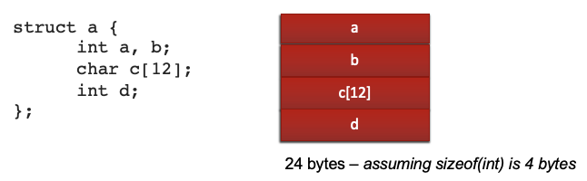
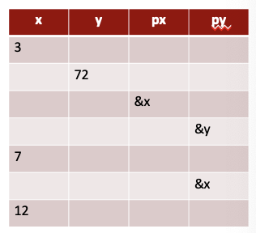

# Compiler Steps Overview
- step 1: preprocessor
	- runs before the compiler
- step 2: compiler
	- convert C into assembly
- step 3: assembler
- step 4: linker
	- link multiple files, subroutines, etc. together

# Problem-Oriented Language
- a language whose statements resemble terminology of the user application-oriented language rather than machine language
-  in other words a language in which algorithms are expressed in human terminology (math, science, business) as opposed to machine implementation terms
- gives symbolic names to values
- provides expressiveness
- abstract the underlying hardware
- enhance code readability
- provide safeguards against bugs

# Generations
- ancestors
	- Fortran
	- Algol 60
	- PL/I
- parents
	- (CPL, BCPL, B) -> C
- descendants
	- Perl
	- Java
	- Python
	- C++
	- C#

# C
- C is the language that will allow you to do anything
- it is used to write operating systems, other languages, low-level hardware drivers, cryptography, networking, etc.
- it was designed to be easily compiled and to product compact, efficient code
- it won't check for many runtime errors
- Note: it was invented to implement system software for a small computer 
- C is not your friend and trusts you and will do exactly what you ask (it is quite certain you are a careful, knowledgeable programmer)
- all the symbols mean something
- "I'll just type something in and the compiler will fix it for me” won't work

## Languages
- many problem-oriented programming languages have features that try to prevent the programmer from doing something wrong or letting you know when you do
	- ex. Java does not allow you access memory by address
	- ex. Java throws an exception when you have an array out of bounds
- C is not one of these languages

## Differences Between Java And C
- C is about 49 years old and pre-dates Java by about 25 years
- C is procedural; no objects or classes
- C structs are used in place of classes
- pointers are used in place of object references
- no overloading of function names, each function must have a unique name
- C does not include strings
	- strings are arrays of characters and characters are 8-bit integers
- C does not have print or I/O built-in
	- for strings and printing, use standard C libraries

## Expressions And Control Statements
- expressions are very similar
	- all expressions (including assignments) yield a value
	- order of precedence is the same
	- no “new” ,“instanceof”, or >>> (from Java)
	- C does have: “sizeof”, unary &, unary *, and binary ->
- control statements are quite similar
	- old friends `if`, `while`, `do-while`, `for`, `switch`, `break`, `continue`, `return`

## Data Types
- integer types

|type|size|
|-|-|
|unsigned char|8 bits|
|unsigned short [int]|16 bits|
|unsigned int|16/32 bits|
|unsigned long [int]|32/64 bits|
|unsigned long long [int]|64 bits|

- floating point types

|type|size|
|-|-|
|float|32 bits|
|double|64 bits|
|long double|80/128 bits|

- aggregate types
	- array
	- struct
	- union

- pointers (a special kind of integer)

## How Big A Data Type Is Depends...
- it depends on your platform
	- char (exactly 8 bits)
	- short int (at least 16 bits)
	- int (at least 16 bits)
	- long int (at least 32 bits)
- you can find the size of a datatype with "sizeof"
	- "sizeof" is a compile-time constant reflecting the number of bytes held by a data type or instance
	- sizeof(char) <= sizeof(short) <= sizeof(int) <= sizeof(long)
	- sizeof(char) = 1

## Booleans
- C historically did not have a boolean data type
	- instead we can use integers to represent boolean values
- any integer that is 0 evaluates as false
- any non-zero integer evaluates as true
- NUL character `'\0'` evaluates to false
- a memory address that is 0x0 evaluates as false

## Strings
- strings are arrays of characters
- strings end with an ASCII NUL (aka `'\0'`)

```c
// defining a string
char mystr[6]

// initializing a string
char mystr[6]= {'H', 'e', 'l', 'l', 'o', '\0'};

// initializing a string (C compiler determines length of array)
char mystr[] = {'H', 'e', 'l', 'l', 'o', '\0'};
char mystr[] = "Hello";

// functions dealing with strings
strlen()
strcpy()
strdup()
```

```char s[6] = "hello"```
- is the same as ```s .stringz "hello" ;6 memory locations, ends with 0```
- s is the memory address where the string starts
- Note: never use ```sizeof(s)``` when you want string length
	- include ```#include <string.h>``` and use ```strlen(s)``` for string length

## printf()
- printf() is a function in the Standard IO Library
	- make sure to add ```#include <stdio.h>```

|format code|meaning|
|-|-|
|%d|decimal integer (int)|
|%x|hex integer (int)|
|%f|floating number(float)|
|%s|string (char * or char \[\])|
|%c|character (char)|
|%p|pointer (for debugging)|

- ex. ```printf("Person: %s  GPA: %f\n", name, gpa);``` might print ```Person: Dan  GPA: 2.5```

# The C Preprocessor
- the C preprocessor does two main things
	- file inclusion (#include)
	- macro expansion (#define)
- preprocessor directives always start with #

## `#include`
- conventionally, we only include files that end in ".h"
- these consist of declarations (including function prototypes) and macro definitions but no executable code
- if you surround the file name with:
	- double quotes (""), the preprocessor looks in the current directory and then the system directories for the file
	- angle brackets (<>), it looks only in the system directories (/usr/include)
- the lines in an # included file are literally copied in place of the # include

```c
#include <stdio.h>
#include <stdlib.h>
#include <string.h>
#include "mylibrary.h"
```
- Note: these lines do not end in a semicolon

## Include Guards
- avoid including `.c` files since they may duplicate imports, libraries, etc.
- a solution to accidentally `#include`-ing the same header file twice is to write the following in the header file:
```c
#ifndef <HEADER_FILE_NAME>_H
#define <HEADER_FILE_NAME>_H

// insert contents of header file

#endif
```

# Macro Processing
- macro processing: text substitution using some very specific rules
- we're going to want to use symbolic names for constants in several places
	- ex. ```#define NUL_CHAR '\'```
	- ex. ```#define MAXWORDLEN 256```
- these symbolic names are textually replaced in the source code
- if you invoke the compiler with ````gcc -E````, it will show you the preprocessed input file with all the # includes and macros expanded

## Example: Macro Processing
```c
// before C proprocessing
#define NUL_CHHAR '\0'
#define MAXWORDLEN 256

char buf[MAXWORDLEN];
while (buf[i] != NUL_CHAR && i < MAXWORDLEN) {
	i++;
}


// after C proprocessing

#define NUL_CHAR '\0';
#define MAXWORDLEN 256;

char buf[256];
while (buf[i] != '\0' && i < 256) {
	i++;
}
```

## Macros With Arguments
- you can also use macros like functions

```c
#define PRODUCT(a, b) a*b
```
`PRODUCT(4, 5)` would expand to `4*5`
`PROUDCT(x+3, y+4)` would expand to `x+3*y+\4`

- to fix this issue, we would do:
```c
#define PRODUCT(a, b) ((a)*(b))
```
`PRODUCT(x+3, y+4)` would expand to `(x+3)*(y+4)`

# Header Files
- in C, you cannot use a function/variable before you declare it
- header files contain function declarations and global variables
- header files use the `.h` extension
- should not include function implementations
- think of an interface in Java

# Structs
- **struct**: a data type that is used to group together multiple values; contains no methods
	- all data members are publicly visible
- use the `.` operator to access variables inside a struct
- if given a pointer to a struct, use the `->` operator to simultaneously dereference and access it



- the struct tag declares the type (Note: for the above, the type is 'struct a')
- names following the struct tag defines instances of the struct
	- ex. `struct car mikes_car, joes_car;`
- identifier/function names and struct tags occupy separate name spaces
- struct members occupy a name space unique to the containing struct, meaning that `struct b { int b } b;` is legal and not ambiguous
- you can declare a struct type and define an instance (or multiple instances) of the variable at the same time

```c
struct car {
	char mfg[30];
	char model[30];
	int year;
} mikes_car;
```
- Note: `struct car` is a data type but `mikes_car` is a variable of type `struct car`

## Referencing Structure Members
- the `.` operator is used just as in Java to reference members of a structure

```c
printf(%s\n", mikes_car.model);


/* you can't assign a string literal to an array in C */
/* the following is wrong */
johns_car.mfg = "Chevrolet"; 


/* you can use strcpy() and you must make sure your destination has room to hold the source string */
/* don't forget to #include <string.h> */
strcpy(johns_car.mfg, "Chevorlet");
```

# Pointers
- can do the same things you do with addresses in an assembly language
- powerful and potentially dangerous
- no runtime checking (for efficiency)
- Java avoids many of the features of pointers that cause problems, hence the decision to call them references
- in Java:
	- no "address of" of "deference" operator
	- no pointer arithmetic
	- no casting of integer types to pointer types
- pointers contain memory addresses (or NULL)

```assembly
; in assembly we write...
B		.fill	29
BADDR	.fill	B
```
```c
/* in C we write... */
int b = 29;
int *baddr = &b;
```
- Note: & (ampersand) is the "address of" operator; use it to obtain a pointer to an existing data item

## Example: Using Pointers (Assembly)
- to reference what a pointer points to, we use the deference operator `*`
-  `*` acts like "indirect" in LC-3 loads and stores
-  in LC-3 assembly, if we wanted to use BADDR to access the value in B, we used

```assembly
LDI		R1, BADDR	;get B
ADD		R1, R1, #2
STI		R1, BADDR	;set B = R1
```

- in C we write ```*baddr = *baddr + 2```

## Example: Using Pointers (C)
```c
int b = 29;
int *baddr = &b;

printf(“%d\n”, b);
*baddr = 18;
printf(“%d\n”, b);
printf(“%d\n”, *baddr);

/* the above prints the following */
29
18
18
```
- the value stored at `b` has been changed to 18
- `baddr` still contains the address of `b`

## `*` Has 2 Meanings
- don't let the `*` in declarations confuse you about executable statements
- in a type declaration, `*` means "pointer to" and is part of the type
- in an expression, `*` is the "dereference" operator and acts like the "indirect" in the LC-3 loads and stores
- when applied to a pointer, `*` makes the expression mean "what this pointer points to"

```c
/* declaration */
int i, x;
int *px = &x;

/* expression */
i = *px
```

- ex. given `int *ptrx = *y`, what must the type of y be?
	- `y` is a pointer to a pointer to an int
		- this is because `ptrx` is a pointer to an int and `*y` must be an int, then `y` must be a pointer to a pointer to an int

## Pointers And Arrays
```c
int a[10]
int *p
```
- `a` is an array of type int and size 10
- p is a pointer to int (memory address)
- in an expression, an array name becomes a constant pointer to the first element (ex. `a`)
- `a` is the memory where the arrays starts
- `a` can't be changed (but its contents can)
- `a` is the address of `a[0]`

```c
int a[10]
int *p

// legal
p = a		// p is the memory address of the start of the array

// illegal
a = p		// a is a constant pointer
			// you are not allowed to change its value
```

## Strings And Pointers
```c
char str[6] = "Hello";
char *s
```

- Note: a C string is really an array of char
- when you see `char *` think string

## Pointer Arithmetic
- you can add or subtract pointers and integers
	- a pointer plus or minus an integer yields a pointer
 - just like adding to addresses on LC-3 with one additional semantic

```c
int *p = &i;
p = p + 1;		// is interpreted as p = p + 1 * sizeof(*p)
```
- Note: essentially, if p is an int pointer, p + 1 is the address of the next int
	- the address in p is incremented by the size of an int

```c
int b[3] = {9, 12, 13};
int *p = &b[0]
```
- the value of `*p` is 9
- the value of `*(p + 1)` is 12
- the value of `*(p + 2)` is 13
- in an expression, `a[i]` means exactly the same as `*(a + i)`
	- this is why `p[0] = 9, p[1] = 12, p[3] = 13`

```c
// the following expressions are equivalent (an int)
a[5] <--> *(a + 5)
p[5] <--> *(p + 5)


// the following expressionsn are equivalent (pointer to an int)
&a[5] <--> a + 5
&p[5] <--> p + 5
```

## Example: Pointer Arithmetic
```c
int x = 3;
int y = 72;
int *px = &x;
int *py = &y;
*px = 7;
py = px;
x = 12;
printf("%d %d\n", *px, *py);

// What is the output?
// 12 12
```

- the solution is `12 12` since `*px` and `*py` both evaluate to 12 since they are now both pointing to `x`



## Pointers And Structs
- C supports the operator `->`
- the left operand must be a pointer to struct and the right operand a struct member
- `->` is a shorthand for `*` and `.`

```c
struct myStruct {
	int a, b;
}, *p; // p is a pointer to struct myStruct


// the following statements have the same meaning
(*p).a = (*p).b
p -> a = p -> b
```

# Functions
```c
int mult(int a, int b) {
	return a * b
}
```
- two arguments (int) are pushed onto the stack
- returns an int
- pass by value always (not by reference)
- copies of arguments are pushed onto the stack

## `main()`
```c
int main(int argc, char *argv[]) {
	return 0;
}
```
- `main()` is just another function
- it is the first function invoked when you run your program from the command line
- Note: the convention is to return 0 on success, or non-0 on error

## `void`
```c
void func(void) {
	printf("Hello\n")
}
```
- void is a special keyword
- return type void
	- the function does not return a value
- arguments of void
	- the function does not take any arguments

## Arrays As Arguments
```c
char s[] = "Hello";

void test(char *s) {
	printf("%s\n", s)
}

int main(int argc, char *argv[]) {
	// the following statements have the same meaning
	test(s)			// pointer of s
	test(&s[0])		// address of s at index 0
}
```
- to pass an array into a function, we pass a pointer to the first element
- Note: an array name in an expression (function call) is automatically promoted to a pointer to its first element
	- this includes strings (arrays of char)

## Declare Functions Before You Call Them
```c
// function prototypes
int foo(int);
int bar(char *);

int main() {
	foo(1);
	bar("Bye");
}


// function definition
int foo(int i) {
	// do something
}

// function definition
int bar(char *s) {
	// do something
}
```
- Note: we often put the main() function first but main() needs to know about the functions it will call
	- we add declarations (function prototypes) above the main() that just have name, return type, and args
	- we add function definitions under the main() with the actual implementation

# Command Line Arguments
```c
int main(int argc, char *argv[]) {
	return 0;
}
```
- `argc` is the number of arguments (including the program name itself)
	- think "argument count"
- `argv` is an array of strings
	- aka an array of pointer to char
	- think "argument values"
- call our program by typing `./myprogram cs2110 rocks` in the command line
	- argc == 3
	- argv[0] is "./myprogram"
	- argv[1] is "cs2110"
	- argv[2] is "rocks"

# Hello World! (With C)
```c
// file name: helloworld.c
#include <stdio.h>

int main(int argc, char *argv[]) {
	printf("Hello, World!\n\n");
	
	for (int i = 0; i < argc; i++) {
		printf("Argument %d: '%s'", i, argv[i])
	}
	printf("You have %d arguments.\n", argc);
}
```

- in the terminal, do the following to run the program

```c
// compiles helloworld.c and creates a.out file
$ gcc helloworld.c

// run a.out
$ ./a.out
```