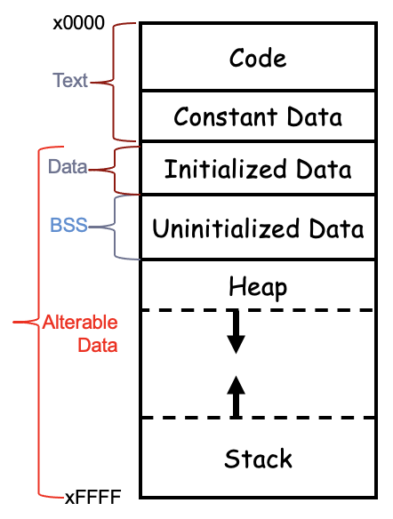
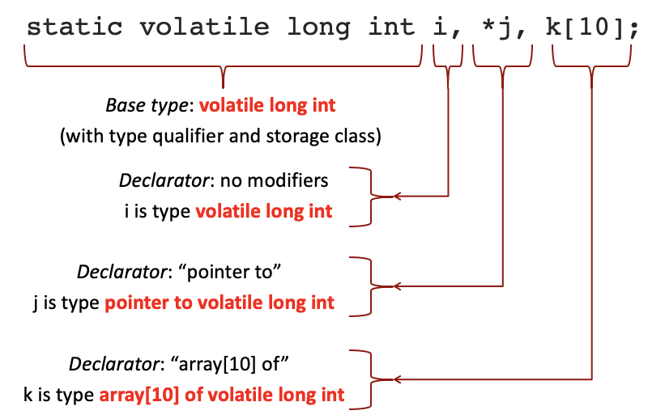
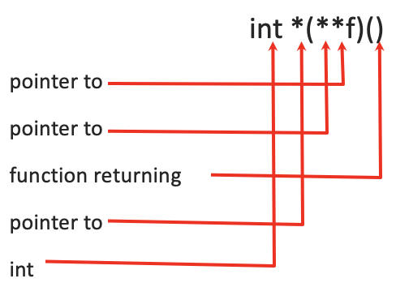
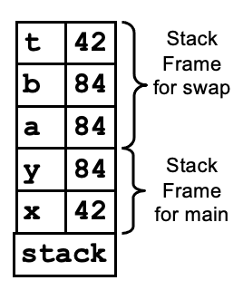
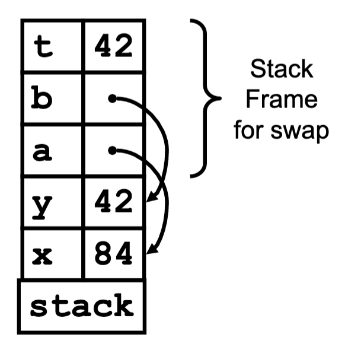

# Storage Location
## Memory Layout
- the traditional C executable has 3 segments
	- text
		- program code (unmodifiable)
		- constant data (maybe)
	-	data
		-	constant data (maybe)
		-	initialized variables
	- BSS
		- uninitialized static data
		- from "block starting with symbol"
		- aka ```.blkw``` from LC-3
	


- stack
	- stores (non-static) local variables and arguments (temporary data)
- heap
	- dynamically allocated memory 
- data
	- global and static variables are stored here
	- Note: static local variables are stored here
- code
	- our executable code

## Scopes
- file scope
	- seen by the entire file after the definition
	- outside the function definition
	- the visibility of a global variable (across files) can be set using the keywords extern or static 

|keyword|external definition|
|-|-|
|static|visible to no other files|
|extern|external reference (visible to other files, declares reference to an external definition elsewhere)|

- block scope
	- seen within the block, after the definition

### Example: Global Scope 
```c
// file1.c
int a[10];			// external definition
static struc r *p;	// this file only
extern float c[100] // ref to c in file2.c


// file2.c
extern int a[10];	// ref to arr in file1.c
static struct r *p	// not the p in file1.c
float c[100];		// definition
```

### Example: Block Scope
```c
#include <stdio.h>
int i = 0;		// #1 -> 
void f(int);

int main(int argc, char *argv[]) {
	i = 1;		// -> #1
	
	int i = 0	// #2 -> 
	i = 2;		// -> #2
	
	for (int i = 0; i < 10; i++) {		// #3 ->
		f(i);		// -> #3
		
		int i = 2;	// #4 ->
		f(i);		// -> #4
	}
	f(i);		// -> #2
}

void f(int j) {
	printf("%d\n", j);
}
```

## Storage Classes And Type Qualifiers
- storage class specifiers
	- register
	- auto
	- static extern
- type qualifiers
	- const
	- volatile
	- restrict

### Storage Class
- storage class tells us where the data will be stored and who will be able to see it
- it is not part of the type and only affects the variables defined or declared using it
- the rules for storage classes are not regular
	- you need to memorize them or have a ready reference

| |outside a function definition|inside a function definition|
|-|-|-|
|\<none\>|**scope**: external definition<br />**storage**: static address|**scope**: within the function<br />**storage**: on the stack|
|auto|N/A|**scope**: within the function<br />**storage**: on the stack|
|static|**scope**: within the file only<br />**storage**: static address|**scope**: within the function<br />**storage**: static address|
|extern|**scope**: external reference<br />**storage**: static address; location determined by file containing the external definition (can't have initializer either)|**scope**: external reference<br />**storage**: static address; location determined by file containing the external definition (can't have initializer either)|
|register|N/A|**scope**: within the function<br />**storage**: register or stack (hint to compiler; use of & not allowed, seldom used|

#### `static` Inside A Function
```c
void funcCounter(void) {
	static int counter = 0; 	// one instance, static memory
	counter++;          	// visible only in function
	printf(“This function was called %d times.\n”, counter);
}
```
- counter is allocated once in the initialized data static area of memory
- counter is not located on the stack
- every call to `funcCounter()` sees the same shared instance of counter
- it is only initialized to 0 once at program load (not every time the function is called)
	- similar to .fill from LC-3

### Type Qualifier
- part of the type (unlike storage class)
- not mutually exclusive with a storage class'

|type qualifier|definition|
|-|-|
|const|the value of this variable may not be changed after initialization|
|volatile|the compiler may not optimize references to this variable|
|restrict|for the lifetime of a pointer, only the pointer itself or a value directly derived from it may be used to access the object to which it points; allows better optimization|

- static (has 2 meanings)
	- inside a function: static changes the storage location to static memory, either data or BSS segment (scope stays local)
	- outside a function: static changes the scope (visibility) to be only visible within the file (the storage location stays in static memory)
 - extern
	 - compiler does not allocate storage
	 - for type checking of the identifier name only
	 - another C file must allocate storage by defining that var name or function
- volatile
	- tells the compiler to not optimize away the variable
	- use this for device registers

```c
// defined before the first function definition in a file
// what is the scope and where is it stored?

double F;
```
- scope is all functions in all files that include a corresponding extern declaration
- stored in static memory

# C Type Declarations
- **declaration**: introduces an identifier and describes its type (scalar, array, struct, or function); is what the compiler needs to accept references to that identifier
	- you may have as many declarations of an identifier as you want within a scope as long as they are consistent
- **definition**: instantiates/implements this identifier
	- ex. a definition allocates storage for variables or defines the function of the body
	- you may only have one definition of an identifier within a scope



- `base type`
	- the type (or struct s or a typedef), and optionally a storage class and/or a type qualifier
	- applies to all names up until the semicolon
- `declarators`
	- the list of declarator, separated by comma
	- each of these declares a type for each identifier (the variable name)
	- each is based on the base type, but stands alone
	- consists of sensible combinations of “pointer to”, “array of”, or “function returning”, ending with the base type

`int *x, y, z;`
- Note: each declarator is separate
- `x``` is a pointer to an int
- `y` is just an int

`int *x, *y, *z;`
- `x`, `y`, `z` are all "pointer to an int"

## Reading And Forming Declarators
- C declarations combining pointers, arrays, and functions aren't mysterious
- Rule 1: remember the precedence of the declarators
	- () and [] declarators get processed first
	- * gets processed last
	- parentheses change the precedence order (just as in expressions)
- Rule 2: read or form the declarations from the inside out

`int *(**f)()`
	- ```f``` is a pointer to a pointer to a function returning a pointer to int



## How Do We Read Declarators Automatically?
- **parsing**: determining which grammar productions (rules) were used to generate a sentence

```c
$ gcc dcl.c
$ ./a.out
int b()
b:  function returning int

int c[1]
c:  array[1] of int

int *c[1]
c:  array[1] of pointer to int

int (*c)[1]
c:  pointer to array[1] of int

int *silly()
silly:  function returning pointer to int

int **silly()
silly:  function returning pointer to pointer to int

int *(*silly)()
silly:  pointer to function returning pointer to int

int *(**f)()
f:  pointer to pointer to function returning pointer to int
```

## Declaring vs. Using Pointers And Arrays
- recall that `*`, `()`, and `[]` have different meaninngns in declarations and executable statements
- ex. `int *(**f)()`
	- pointer to pointer to function returning pointer to int
	- `*f` is a pointer to function returning pointer to int
	- `**f` is a function returning pointer to int
	- `(**f)()` calls the function and returns pointer to int
	- `*(**f)()` is of type int
- ex. `char *b();`
	- function returning pointer to char
	- `char *bp = b();` is pointer to char
	- `char bc = *b();` is char
- ex. `double **d`
	- pointer to pointer to double
	- `double *pd = *d;` is pointer to double
	- `double dv = **d;` is a double
- ex.` int *(*c)[]`
	- pointer to array of pointers to int
	- `int *apc[]* = *c;` is an array of pointers to int
	- `int *pc* = (*c)[1];` is a pointer to int
	- `int cv = *(*c)[1];` is an int

## `typedef`
- `typedef` is a shortcut that allows you to create a new alias for a type
- it does not create a new type
- start the declaration with `typedef` and put the alias name where you would put the variable name
- allows you to create another name for an existing type

```c
// define an array of 5 struct a named b
struct a b[5];

// create a type alias for an array of 5 struct a
typedef struct a sa5[5];

// now we can use sa5 as a type name
sa5 c;
```
- Note: `b` and `c` are the same type

```c
typedef unsigned long size_t;
size_t position;
```
- the type of `position` is `unsigned long`

## C Functions
- must be declared before they are used (aka needs function prototypes)
	- ex. `int nfact(int);`
	- a function prototype is automatically given the extern storage class
- you may have an number of declarations as long as they're identical
- you may only have one function definition
- parameters are always passed as call-by-value
	- copies of the parameters (even structs) are pushed on the stack
	- arrays turn into pointers to their first elements, a copy of which is passed
- you can implement call-by-reference parameters easily with pointers

## Example: `swap()`
```c
/* the following swap does not work*/
int x = 42;
int y = 84;
swap(x, y);

// ...

void swap(int a, int b) {
	int t;
	t = a;
	a = b;
	b = t;
}
```
- Note: code will not swap because C primitives are pass-by-value and thus will only change within the method
	- think of the `swap(x, y)` method as adding a subroutine on top of stack
	- changing variables within the `swap(x, y)` method will only change `x` and `y` within the method and doesn't actually swap the `x` and `y` values that are passed in



```c
/* the following swap works*/
int x = 42;
int y = 84;
swap(&x, &y);

...

void swap(int *a, int *b) {
	int t;
	t = *a;
	*a = *b;
	*b = t;
}
```
- Note: the above code will work because we are swapping values determined by pointers that are passed into the method
	- pointers tell you where the original values are located



# Arrays
- manual bounds checking
- to determine the length of an array:
	- if defined in the scope: `sizeof(ary) / sizeof(ary[0])`
	- if it is passed as a parameter or in the heap -> you must pass the length as a parameter
- for an array in the heap, you may need to keep both the allocated size of the array and the number of elements currently stored in the array
- C arrays have but a single dimension (but supports arrays of arrays, etc.)

### Arrays (Like Pointers) Have 2 Meanings
- used in a declaration, an array in C describes a block of storage
	- ex. `short array[1026];`
- arrays (and all C variables) are always allocated in a single contiguous memory block
	- ex. `short matrix[10][10][10];`

## Arrays In Expression
- used in an expression, the array name acts as a constant pointer to the first element of the storage allocated for the array
	- Note: never put `&` in front of an array name
- anything you can do with the array name, you can do with a pointer
- any array element selection you can do using subscripts can be done with pointers and pointer arithmetic because the subscript operator (square brackets) is literally a typographical shortcut for pointer arithmetic
	- `*(p+n)` is literally the same as `p[n]` (or more surprisingly `n[p]`)

## Initializing Arrays
```c
// using values in braces "{}"
int ib[5] = { 5, 4, 3, 2, 1 };

// the compiler will even count them for you
int ib[] = { 5, 4, 3, 2, 1, 0 };

// characters initializers are similar
char cb[] = { ‘x’, ‘y’, ‘z’ };

// but you can arrange for special treatment
char cb[] = “hello”;

// Note: the above is very different from
char *cb = “hello”;
```

## Notes About `sizeof`
```c
char c1[] = "hello";
char *c2 = "hello";

// sizeof(c1) == 6 -> the array size including null terminator
// sizeof(c2) == 8 -> the size of a pointer on your system
// strlen(c1) == 5 -> same as strlen(c2)
```

## Location Of Arrays vs. Literals
```c
// the declaration char *cp lives on the stack
// the definition "Hello" lives in constant data
// Note: literals in C cannot be modified
char *cp = "Hello";

// the declaration and definition of char ca[] = "Hello" lives on the stack
char ca[] = "Hello";
```

| |can pointer value be changed?|can "Hello" be changed?|
|-|-|-|
|`char *cp = "Hello"`|yes|no|
|`char ca[] = "Hello"`|no|yes|

## Confusion About Pointers And Arrays
```c
int ia[6];
int *ip;

// Note: ia = &ia[0]

ip = ia // legal statement
ia = ip // illegal statement because ia is constant...
		// ia = <anything> at compile time is illegal 
```

```c
int ia[6];
int *ip;
ip = ia
ip[2] = 87

*ip		// points to ia[0]
ip++	// adds sizeof(int) to ip
*ip		/; points to ia[1]
```

## More Pointer Arithmetic
- sometimes pointer arithmetic is faster than subscripting, but these days the optimizer will unroll the multiplication (so it doesn't really matter)

```c
int i;
int ia[MAX]
for (i = 0; i < MAX; i++) {
	ia[i] = 0;
}

---

int *ip
int ia[MAX]
for (ip = ia; ip < ia + MAX; ip++) {
	*ip = 0;
}
```
- the above methods are equivalent but the one on top requires multiplication while the bottom uses addition

## Example: Swapping Pointers
```c
int arr1[] = {1, 2, 3};
int arr2[] = {9, 8, 7, 6};
int *p1 = arr1;
int *p2 = arr2;
swap_pointers(&p1, &p2);

// ...

void swap_pointers(int **a, int **b) { 
	/* Choice 2 */
	int *t;
	t = *a;
	*a = *b;
	*b = t;
}
```