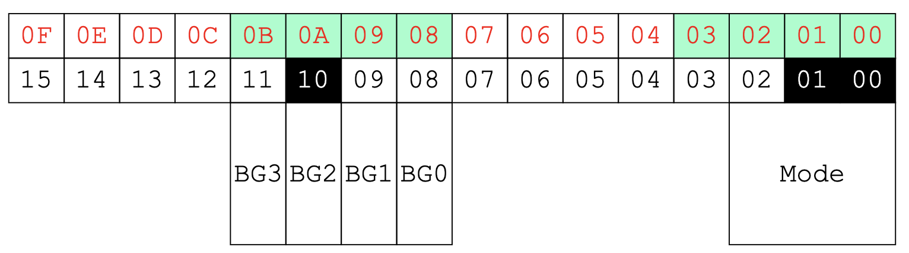
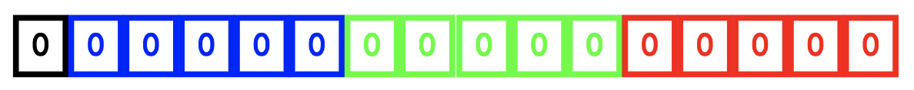
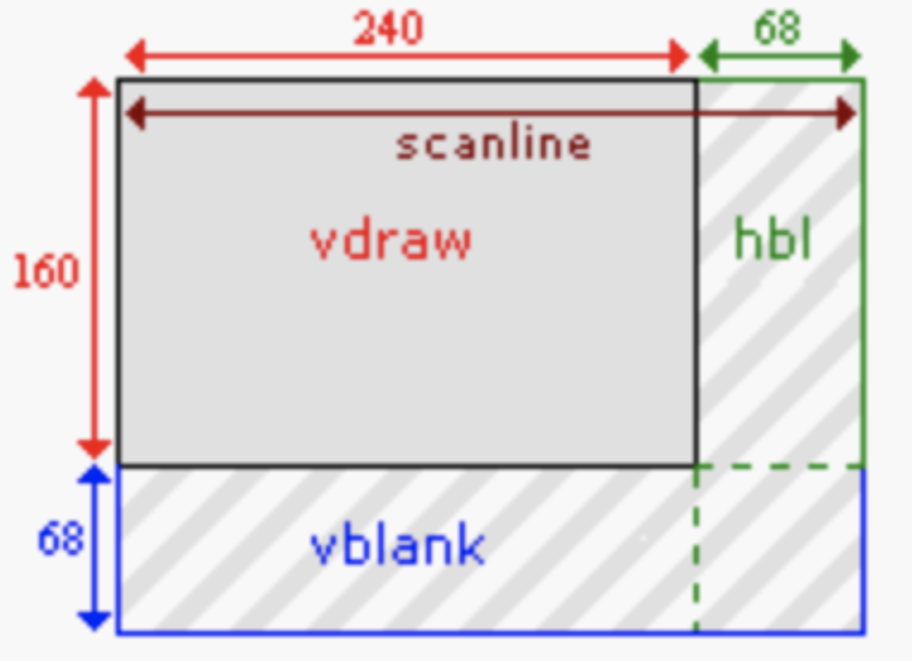
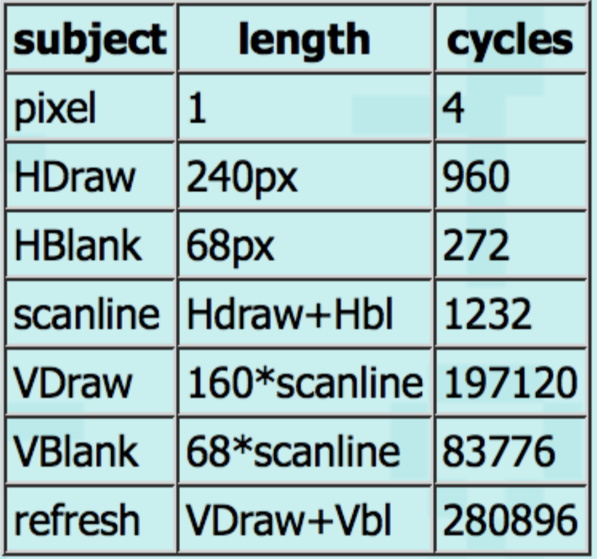

# Why GBA?
- programming on bare metal
- no operating system
- makes C seem more obvious
- relatively simple hardware
- slow...understand performance tradeoffs
- fun!

# Von Neumann Components
## Processor
- ARM-7-TDMI 3 stage pipelined RISC processor
- very popular embedded processor in 2000-2001
- 16.78 MHz clock speed
	- our laptop and computers are about 100 times faster than the GBA
- datatypes
	- 8 bit (char)
	- 16 bit (short)
	- 32 bit (int)
	- 32 bit address space

## Inputs
- 10 buttons
	- start
	- select
	- A
	- B
	- left
	- right
	- up
	- down
	- left shoulder
	- right shoulder
- the input is a 1 button register
	- 1 bit per button (0 -> pressed; 1 -> not pressed)

## Output
- 240 x 160 pixel color video display screen
	- 6 display modes
	- bit mapped
	- tiled
	- hardware support for sprites
- sound effect generators
- direct sound hardware (DAC)

# Programming On The GBA
- use the tutorial at http://www.coranac.com/tonc/text/

# Datatypes On The GBA
- integers
	- all can be signed, the default, or unsigned
	- char (1 byte)
	- short int OR short (2 bytes)
	- int (4 bytes)
	- long int / long (8 bytes)
- floating point
	- avoid because they’re software emulated
	- float
	- double

# Device Registers
- GBA contains a register that controls the many video modes on the GBA
	- `REG_DISPCTL` is at `0x0400 0000`
	- to access `REG_DISPCTL` we can write either:
		- `*(unsigned short *)0x04000000`
		- `#define REG_DISPCTL (*(unsigned short *)0x04000000)`
- Note: we will use Mode 3 and BG2
	- `REG_DISPCTL = 0x403`
		- `0x403` since we need to turn on the BG2 bit as well as bit 0 and 1 for Mode 3



# Video Memory (In Mode 3)
- we use a `videoBuffer` to tell the GBA hardware what values we want to display on the screen
	- `videoBuffer` is a 1D array of pixels (actually a 2D array laid out in 1D)
	- video memory begins at `0x06000000`
- consists of 160 x 240-bit unsigned shorts
	- the display has 160 rows and 240 columns
- rows are assigned contiguously
- **offset**: address relative to video memory
	- a pixel at row `n`, column `m` would be:
		- `offset = n * (total number of columns) + m`
	- the address in the GBA would be:
		-  `0x06000000 + offset`

# Setting A Pixel To A Color
- colors are set using 16-bit binary numbers
	- bit 0-4 control red
	- bit 5-9 control green
	- bit 10-14 control blue
	- bit 15 is ignored
- ex. 0x0000 is black; 0x8000 is also black
- ex. 0x7C00 -> blue



- to set a pixel just do:
```c
unsigned short *videoBuffer = (unsigned short *)0x0600000;
videoBuffer[offset] = 0x7fff; // or whatever color in hex
```

# Blanking
- GBA screen is refreshed at 60 Hz
- there are pauses in the drawing process
	- for each scanline (160 lines)
		- raw scanline (240 pixels)
		- Hblank (68 pixels)
	- Vblank (68 scanlines)
- **tearing**: the `videoBuffer` is updated during VDraw, causing the top half of the screen to show the old image and the bottom half to show the new image
- to avoid tearing, positional data is usually updated at the VBlank
	- this is why most games run at 60 or 30 fps

# HBlank And VBlank
- **VDraw**: GBA copies one row of pixels at a time from the `videoBuffer` to the screen
	- not instantaneous (aka halfway through VDraw, only half of the scanlines have been drawn)
- **VBlank**: nothing happens
	- you want to update `videoBuffer` during VBlank



- during `vdraw` perform other useful computations
- during `vblank` update `videoBuffer`

## Implementing `waitForVBlank`
- `SCANLINECOUNTER > 160` means GBA is in VBlank
	- issue 1: scanline is past 160, there is not enough time to update
	- issue 2: app logic runs too fast and we draw 2 frames during the same VBlank
- solution -> wait for `SCANLINECOUNTER == 160` and wait for `SCANLINECOUNTER` past VBlank to come back to VBlank

```c
void waitForVBlank() {
	while (SCANLINECOUNTER > 160);
	while (SCANLINECOUNTER < 160);
	vBlankCounter++;
}
```

## Drawing Times
- a full screen refresh takes exactly 280896 cycles, divided by the clock speed which gives a frame rate of 59.73
- from the draw/blank periods, we can see that there are 4 cycles per pixel and 1232 cycles per scanline


