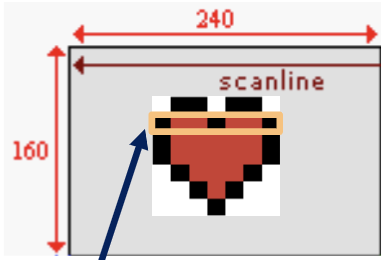

# Direct Memory Access (DMA)
- hardware supported data copy
	- optimized large array copies (up to 10x as fast as array copies)
	- you set it up, the CPU is halted, data is transferred, and CPU gains back control
	- Note: reckless use of DMA can block interrupts
- DMA is fast but not instant
	- cannot draw a full-screen image in a single VBlank cycle, but it can draw without tearing (before VDraw catches up)

## The DMA Controller
- the DMA controller is not connected to the CPU, but the CPU can control it by writing to specific memory locations
- when DMA operates, it "steals" cycles from the CPU, and will return control to the CPU once it completes
- there are 12 DMA registers for 4 DMA channels (since each channel has a source, destination, and control register)

## DMA Channels
- channel 0
	- highest priority
	- time critical operations
- channel 1 and 2
	- transfer sound chunks to sound buffer
- channel 3
	- lowest priority
	- general purpose copies, like loading tiles or bitmaps into memory

## Using DMA
- source
	- `REG_DMAxSAD` (x = 0, 1, 2, 3)
	- the location of the data that will be copied (typically short pointers/addresses)
	- Note: takes an address not a value
- destination
	- `REG_DMAxDAD`
	- where to copy the data do (typically a pointer to `videoBuffer` with offset added)
- amount
	- `REG_DMAxCNT` (DMA control)
	- how much to copy

## DMA Control Register (REG_DMAxCNT)
- lower 16 bits contain amount to transfer
- upper 16 bits contain other options

|bits|name|define|description|
|-|-|-|-|
|0~15|N|-|number of transfers|
|21~22|DA|`DMA_DST_INC`|00: increment after each transfer (default)|
|||`DMA_DST_DEC`|01: decrement after each transfer|
|||`DMA_DST_FIXED`|10: none; address is fixed|
|||`DMA_DST_RESET`|11: increment the destination during the transfer and reset to the original value when done|
|23~24|SA|`DMA_SRC_INC`|00: increment after each transfer (default); aka memory copy|
|||`DMA_SRC_DEC`|01: decrement after each transfer|
|||`DMA_SRC_FIXED`|10: none; address is fixed; aka memory fill|
|25|R|`DMA_REPEAT`|repeats the copy at each VBlank or HBlank if the DMA timing has been set to those modes|
|26|CS|`DMA_16`|chunk size 16, sets DMA to copy by halfword (if 0)|
|||`DMA_32`|chunk size 32, sets DMA to copy by word (if 1)|
|28~29|TM|`DMA_NOW`|00: start immediately|
|||`DMA_AT_VBLANK`|01: start at VBlank|
|||`DMA_AT_HBLANK`|10: start at HBlank|
|||`DMA_AT_REFRESH`|11: ???|
|30|I|`DMA_IRQ`|interrupt request; raise an interrupt when finished|
|31|En|`DMA_ON`|enable the DMA transfer for this channel|
- Note: `DMA_SRC_RESET` doesn't exist for `DMA_SRC` as code  is forbidden
- Note: make local variables `volatile` if using their address for a DMA fill

## Example: Image On Screen
- when both source and destination are set to increase (`DMA_SRC_INC` and `DMA_DST_INC`) after each copy,an element-wise copy will occur
	-	useful for drawing images

## Example: Color On Screen
- if the destination is set to increment (`DMA_DST_INC`) but source is fixed (`DMA_SRC_FIXED`), then a single value will be used to fill the entire buffer
	- useful for filling the screen with a single color

## Non-Full Screen Images
- to copy non-full screen images, copy line by line
	- this is because the next line of the source is not the next line of the destination (see below)



## DMA Setup
- DMA_CONTROLLER struct with the 3 registers

```c
typedef struct {
	const volatile void *src;	// 4 bytes
	const volatile void *dst;	// 4 bytes
	u32 cnt;					// 32 bits -> 4 bytes
}, DMA_CONTROLLER
	
#define DMA((volatile DMA_CONTROLLER *) 0x040000b0)
#define DMA_TRANSFER(_dst, _src, _count, _ch, _mode)

do {
	DMA[_ch].cnt = 0
	DMA[_ch].src = (const void*)(_src)
	DMA[_ch].dst = (void*)(_dst);
	DMA[_ch].cnt = (_count) | (_mode)
} while(0)

void dma_memcpy(void *dst, const void *src, u16 count) {
	DMA[3].cnt = 0
	DMA[3].src = src
	DMA[3].dst = dst
	DMA[3].cnt = count | DMA_32 | DMA_ON;
}
```
- we map a struct array (of 4 elements, 1 for each channel) over the DMA registers
	- ex. `DMA[3]` is used to access channel 3
	- Note: each channel occupies 12 bytes

## DMA Timing
- clearing a DMA register before its scheduled copy occurs will stop it from ever happening
	- careful when using delayed DMA
- even immediate DMA has a 2 cycle delay
	- DMA calls in immediate succession could cancel the earlier one
	- 2 cycles is short enough that returning from the DMA setup function allows the copy to begin before other code executes

## Example: Loop Template
```c
// initialize

while true {
	previousState = currentState
	
	// check buttons
	// calculate new values for currentState
	
	waitForVBlank();
	
	// undraw using previousState
	// draw using currentState
	
	// set gameState to INITPLAY
	
	while true {
		previousState = currentState
		
		if (gameState == PLAY) {
			// check buttons
			// calculate new values for currentState
		} else if (gameState == INITPLAY) {
			// initialize the currentState
		}
		
		waitForVBlank();
		
		if (gameState == PLAY) {
			// undraw using previousState
			// draw using currentState
		} else if (gameState == INITPLAY) {
			gameState = PLAY;
		}
	}
}
```