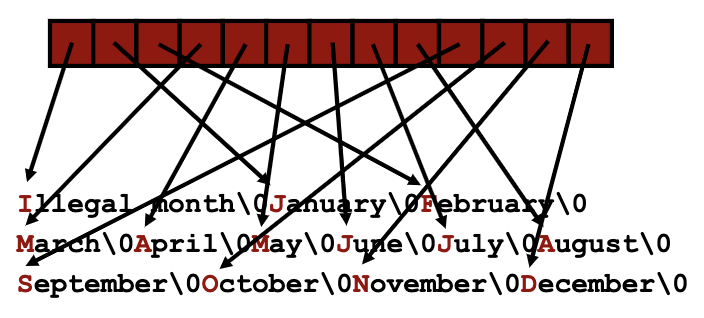
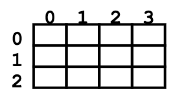
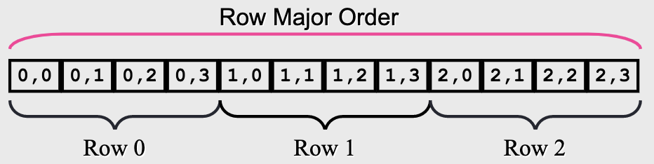

# Arrays Of Pointers (Marginally Indexed Arrays)
```
char *month_name(int n) {
	static char *name[] = {
		"Illegal month",
		"January", "February", "March",
		"April", "May", "June",
		"July", "August", "September",
		"October", "November", "December”
	};
	return (n < 1 || n > 12) ? name[0] : name[n];
}
```
- `char *name[]` looks like the following



- Note: the static keyword is important as `char *name[]` is not stored on the stack frame like a local variable, instead it is stored in static area memory (like a global variable)

# Multi-Dimensional Arrays
`int ia[3][4]` (3 rows, 4 columns)

- defined at compile time
- Note: sizes must be declared





- C uses row major order
- ex. `sizeof ia[3][4]` = 4 (since `ia[3][4]` is an integer type)
- ex .`sizeof ia[3]` = 4 * 4 = 16 (since `ia[3]` is an array size 4 of integers)
	- Note: you strip off type from left to right (`ia[3][4]` becomes `ia[4]`)
- ex. `sizeof ia` = 3 * 4 * 4 = 48 (rows * cols * sizeof int)
	- Note: type of `ia` is `array[5] of array[7] of int`

# 1D And 2D Arrays
- one dimensional array `int ia[6]`
	- address of beginning of array: `ia = &ia[0]`
- two dimensional array `int ia[3][6]`
	- address of beginning of array: `ia = &ia[0][0]`
	- address of row 0: `ia[0] = &ia[0][0]`
	- address of row 1: `ia[0] = &ia[1][0]`
	- address of row 2: `ia[0] = &ia[2][0]`
- ex. Given the declarations `char *a[]`and `char b[][5]`, why do the expressions `a[1][1]` and `b[1][1]` appear to do the same thing, but navigate completely different data structures?
	- because `a[1]` is of type `pointer to char`, it yields a pointer which happens to point to the first character of a string
	- because `b[1]` is of type `array[5] of char`, in an expression it is promoted to a pointer to the first element of a 5 char array
	- because `sizeof(a[1])` is 8 (assuming 64-bit pointers) and `sizeof(b[1])` is 5.  

## Element Access
- given a row and a column index
- `location = row_index * sizeof(row) + column_index * sizeof(arr_type)`

## Example: Pointer Calculations
- if we want to compute memory addresses yourself
	- cast the pointer to `(char *)`
		- `sizeof(char) = 1` (1 byte)
- in order to access element(row, col) in array:
```c
int arr[5][10]
int offset = (r * 10 + c) * sizeof(int);
int *p = (int *)((char *)arr + offset)
```
- `p` points to the address of `arr[row][col]`
- `p+1` points to `arr[row][col + 1]`

# Multidimensional Array Paramters
`int arr[][4][5]`
- for multidimensional arrays, we can omit the first parameter
- why? 
  - think 1D... if asked to calculate the memory address of a given element, we don't need to know the full size, just where the array starts
  - think 2D... if asked to caluclate the address at (i, j) we do `offset = i * columns + j`
  - for 3D... it is because:
    - a declaration does not allocate storage and C does not check array bounds
    - the compiler doesn't need to know how long the array is to calculate the position of its elements

## 3D Arrays
`int a[3][4][5]`
- a is an array with 3 slices, 4 rows, 5 columns
- to calculate offset we do,  `offset = (i * rows * columns) + (j * columns) + k`
- `a[i][j][k] == *(*(*(a + i) + j) + k)`