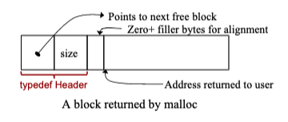

# Dynamic Allocation
## Dynamic Storage
- ex. how much space do we need to allot in order to allow the user to enter some data?
  - we can use `malloc()` and `free()` to help us with this task
    - the methods help create and manage the heap for us, allowing us to grab storage at runtime

## `malloc()`
```c
struct r {
	char name[40];
	double gpa;
	struct r *next;
};

// *rp exists in the stack
struct r *rp;

// malloc() allocates sizeof(struct r) bytes in the heap
rp = malloc(sizeof(struct r));

// ALWAYS CHECK FOR NULL!
if (rp == NULL) {
  /* handle error */
}
```

```c
// another way to do NULL check
if (!(rp = malloc(sizeof struct r))) {
	/* handle error */
}
```

- Note: `malloc()` will return null if the heap and the stack collide
  - if you don't do a null check, you can get `segfault` errors
- options for handling error
  - abort
  - ask again
  - save user data
  - ask for less bytes
  - free up memory/variable/something

## Escape From Type-Checking
- `malloc()` returns a pointer to at least as many bytes as requested
- `malloc()` is declared as `void *malloc(unsigned long)`
- C uses the idiom "pointer to void" for a generic pointer
  - to be safe, you should cast this pointer to the correct type so that type-checking can work for you again
  - otherwise, the compiler will silently cast your `void *` pointer into any other kind of pointer without checking

```c
int *ip;
ip = (int *)malloc(sizeof int);
```

## `free()`
- when done with a chunk of storage(), use `free()` to make it available for reuse
- from our previous example, `free(rp)` returns the memory back to the heap for reuse by someone else
- you MUST NOT use the value in `rp` after the call to `free()`, nor may you dereference the memory it points to
- you CAN assign a new value to `rp` (make `rp` point to something else)
- there is no guarantee what is located at `*rp` after you call `free(rp)`
  - we assume it is garbage data
- with modern C libraries, `free(NULL)` does nothing but is also not an error

## Memory Allocation Functions
- `void *malloc(size_t n);`
  - aka memory allocation
  - allocates (at least) n bytes of memory on the heap, and returns a pointer to it
  - assume memory contains garbage values
  - faster than `calloc()`
- `void *calloc(size_t num, size_t size);`
  - aka clear allocation
  - allocates (at least) `num * size` bytes of memory on the heap, and returns a pointer to it
  - memory will be zeroed out
- `void *realloc(void *ptr, size_t n);`
  - aka reallocate
  - reallocates (at least) n bytes of memory on the heap, and returns a pointer to it
  - copies the data starting at ptr that was previously allocated
  - often used to expand the memory size of an existing object on the heap

# Handling Persistent Data
## Persistent Data I
```c
char *foo(void) {
	static char ca[10];
	return ca;
}

// Note: a and b both point to the same location and contain the same values (even if the value that foo() returns is unique.
char *a = foo();
char *b = foo();
```

## Persistent Data II
```c
char *foo(void) {
	char ca[10];
	return ca;
}
```

- since `ca` was allocated on the stack during the function call, it is now pointing to garbage data

## Persistent Data III
```c
char *foo(void) {
	char *ca = malloc(...);
	/* error checking but no free */
	return ca;
}
```

- this works but the caller needs to know that they're responsible for `free()`

# Memory Leaks
- memory leaks occur when the programmer loses track of memory allocated by `malloc` or other functions that call `malloc`

```c
// Note: this function causes a memory leak

void foo(void) {
	char *ca = malloc(...)
	/* no free */
	return;
}
```

## Memory Management
- some functions that call `malloc`
  - `calloc`
  - `strdup`
  - `regcmp`
  - etc.
- C does not do automatic memory management for efficiency reasons

## `realloc()`
```c
ptr = realloc(ptr, num_bytes);
```

- what `realloc` does conceptually...
  - find space for new allocation
  - copy original data into nenw space
  - free old space
  - return pointer to new space
- `realloc` may return
  - same pointer
  - different pointer
  - NULL

```c
// Note: this is not a good idea because if realloc returns NULL, we lose the data in cp
cp = realloc(cp, n);
```

- the correct way to `realloc`

```c
void *tmp;
if ((tmp = realloc(cp, ...)) == NULL) {
	/* handle realloc error */
} else {
	cp = tmp;
	
	// Note: never do the following since cp and tmp points to the same memory address
	.. free(tmp);
}
```

- other edge cases
  - `realloc(NULL, n)` acts the same as `malloc(n);`
  - `realloc(cp, 0)` acts the same as  `free(cp);` only on some compilers
  - these edge cases can be used to make `realloc` work in a single loop design to build a dynamic structure such as a linked list

```c
int size = 0
int *ip = NULL;
int *temp;
int i;
char buffer[80];
while(fgets(buffer, 80, stdin) != NULL) {
	size++;
	
	// without the edge case realloc(NULL, n) we need the following code
	// if (ip == NULL) {
	// 	malloc(size * sizeof(*temp));
	//	 }
	if ((temp = realloc(ip, size * sizeof(*temp))) == NULL) {
		fprintf(stderr, "realloc failure\n");
		exit(EXIT_FAILURE);
	}
	ip = temp;
	ip[size - 1] = strtol(buffer, NULL, 10);
}
```

# What Can Go Wrong With Dynamic Allocation?
- allocate a block and lose it by losing the value of the pointer
- allocate a block of memory and use the contents without initialization
- read or write beyond the boundaries of the block
- free a block but continue to use the contents
- call `realloc` to expand a block of memory, and once removed keep using the old address
- fail to notice error returns

## Example: Dynamic Allocation 
```c
// INCORRECT: reinitialization p = p->next uses memory that has been freed
for (struct node *p = head; p != NULL; p = p->next) {
	free(p);
}

// CORRECT
struct node *t;
for (struct node *p = head; p != NULL; p = t) {
	t = p->next;
	free(p);
}
```

# Malloc Implementation
## Memory Management
- the K&R implementations of `malloc()` and `free()` are one of the many ways to implement them

## How K&R `malloc` Works
- circularly linked list to track free memory
  - located in the heap
- the **free list** contains memory available to be `malloc`-ed
- once memory is `malloc`-ed, we don't track it until it is `free`-d
- `void *malloc(size_t n)`
  - delete a node from the free list
  - return a pointer to that node to the program
- `void free(void *ptr)`
  - insert the node pointer to the free list
- each node on the free list is available memory
  - everything on the free list is in heap memory areas that `malloc` has requested from the system
  - other functions can request heap space from the system, but that space will never show up on `malloc`'s free list
- consider this:
  - we want each block in the free list to be as large as possible so that it is more likely to have enough bytes to satisfy a `malloc()` call
  - therefore, when we free a block adjacent to our other memory on the heap, we should merge that block into the adjacent block
- design choices
  - linked list is ordered by memory address (in the heap), but there are other ways we can implement it
- size in K&R `malloc` is the number of units
  - not the number of bytes
  - a block of `sizeof(Header)` is rounded up to the strictest alignment boundary
  - a block is 16 bytes in this implementation

| `sizeof(Header)` | Headersize |
| ---------------- | ---------- |
| 8                | 16         |
| 12               | 16         |
| 16               | 16         |
| 20               | 32         |

- Note: in K&R `malloc`, the circularly linked list contains a base unit of size 0
- Note: in K&R `malloc` if memory was found with more units than asked for, it breaks up the block into the exact amount needed
  - ex. ask for 5 units, memory block contains 8 units
    - K&R `malloc` breaks up the 8 units -> 3 units and 5 units, giving the last 5 units to be used

## A Node In The Free List


- `malloc` returns `(char *)p + Headersize` (where `p` is a pointer to Header)
  - since `p` points to the beginning of a block, `(char *)p + Headersize` is the address of free memory (skipping the Header)

| `nBytes` | `nUnits` |
| -------- | -------- |
| 7        | 2        |
| 15       | 2        |
| 16       | 2        |
| 17       | 3        |
| 32       | 3        |
| 33       | 4        |

- the Header always uses 16 bytes or 1 unit
  - 0 - 16 bytes requires 2 units (since 1 unit for header + 1 unit of memory)
  - 17 - 32 bytes requires 3 units (since 1 unit for header + 2 units of memory)

## Pointer Sent To `free()`
- `char *ap;` points to the address of free memory return to the user
  - since `ap` points to the address of free memory, `(Header *)((char *)ap - Headersize)` points to the Header itself
- when inserting nodes into the free list, insert so that the addresses of each node maintain an increasing order
- after inserting, check if there is any free memory adjacent to the inserted node
  - if there are adjacent nodes, merge the 2 nodes into 1

## `morecore()`
- `morecore()` increases the heap size
- you call `morecore()` when your free list does not have enough memory for something that needs to be stored
  - `sbrk(void * nBytes)` is a Linux system call used in `morecore()` to obtain more memory
- `morecore` returns a pointer pointing to the beginning of the newly added memory or -1 (if there is no more space available)