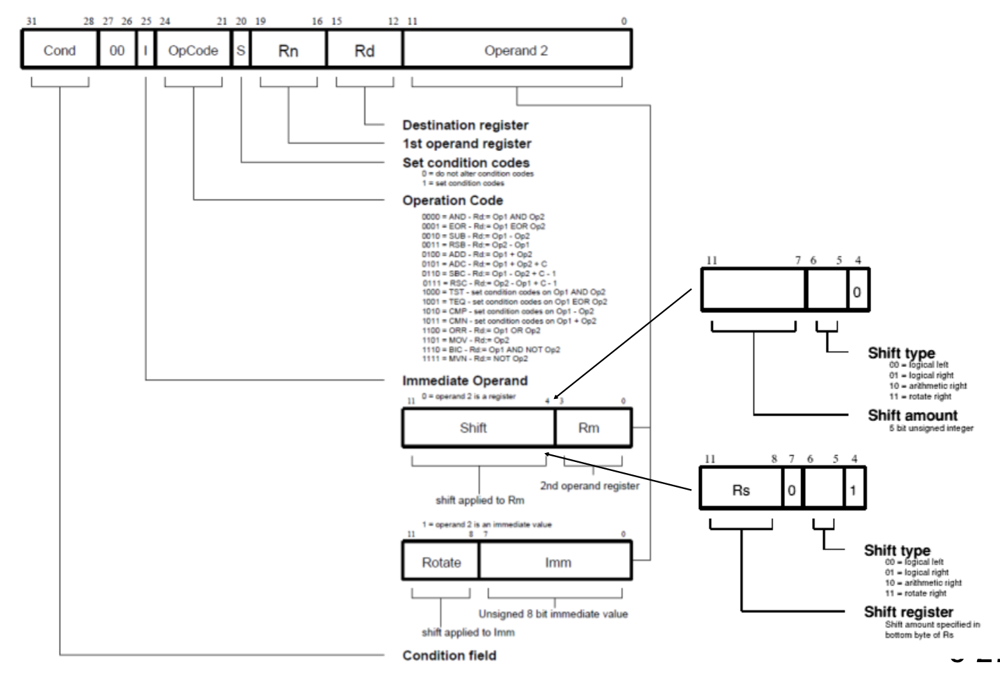

# Instruction Set Architecture (ISA)
- **ISA**: the binary "language" used to talk to a processor
    - all of the programmer-visible components and operations of the computer
    - memory organization
        - address space: 2^32 memory addresses (LC-3 is 2^16)
        - addressability: 32 bits per location (LC-3 is 16)
    - register set
        - 16 registers (R0 through R15)
    - instruction set
    - 16 opcodes

# Some ARMisms
- ARM was a small company in the UK, later sold to SoftBank in 2016
    - Now ARM is being bought by NVIDIA
- ARM technically makes nothing, they sell the rights to use ARM-compliant processors in your design
- originally created for Acorn Computer Company
    - the Acorn was a small cheap computer that used Mostek 6502
    - Acorn decided to make their own processor: the Acorn RISC Machine (A.R.M.)
    - since then, A has become "Advanced" instead of "Acorn"
- ARM has multiple versions
    - Note: the version != processor number
    - ex. ARM-7 does not use ARM-version 7 ISA (it actually uses ARM version 4)

# What Is The Same As LC-3?
- ARM and LC-3 are both load/store architectures
    - means values get into registers using LOAD instruction
    - means values go to memory using STORE instruction
- ARM and LC-3 both have fixed-format instruction encodings
    - LC-3 instructions are 16 bits long
    - ARM has two ISAs in one, so instructions are 32 bits long
- register-register addressing
    - in ARM and LC-3, most instructions take two source registers and store their results in a destination register

# Address Space And Addressability
- LC-3
    - address space is 2^16 memory addresses (aka words or 16 bits)
    - all locations are word addressable (16 bits)
    - addressability is 16 bits (per location)
- ARM
    - address space is 2^32 memory addresses
    - all locations are byte-addressable (8 bits)
    - addressability is 32 bits (per location)

# Processor Modes
| Name       | Mode                                   |
| ---------- | -------------------------------------- |
| user       | normal execution mode                  |
| FIQ        | high priority (fast) interrupt request |
| IRQ        | general purpose interrupts             |
| supervisor | protected mode for O/S                 |
| abort      | used for memory access violations      |
| undefined  | used to handle undefined instructions  |
| system     | runs privileged O/S tasks              |

- Note: LC-3 just has user and supervisor modes
- Note: modes are entered through interrupts or software instructions

# The ALU And The Registers
- ARM has 16 registers (R0 through R15)
    - unlike LC-3, the PC is a register that the programmer can access directly (in ARM, PC = R15)
    - all registers are 32-bits
    - on older ARM ISAs (versions 1-5), storing to PC has "unpredictable results"
- other special purpose registers
    - R11 ("FP") is the frame pointer (similar to R5 in LC-3)
    - R14 ("LR") is the link register (same function as R7 in LC-3) which holds the return address for a subroutine call
    - R13 ("SP") is the stack pointer (same as R6 in LC-3) which holds the address of the top of the stack

## The ARM Register Set: Register Banking
- ARM has registers (R0 through R15) and shadow registers (R8 through R14)
    - when needed, the chipset (using a MUX) swaps out the shadow/banked registers we do not need to save register values on the stack when performing subroutines

# Other Goodies
- ALU in ARM has a "free shift" in front of it
    - ARM's ALU still only has 4 operations (like the LC-3) but it has a shift circuit providing
        - logical shift left (lsl)
        - logical shift right (lsr)
        - arithmetic shift right (asr)
        - rotate right (ror)

# Conditional Execution
- in LC-3, the BR instruction uses the condition code register NZP
- in ARM, the condition code register is called CPSR (current program status register)
    - N (negative result from ALU)
    - Z (zero result from ALU)
    - C (ALU operation had a carry-out of MSbit)
    - V (ALU operation had a twos-complement overflow)
- in ARM, all instructions can "test" these bits

## Branching
- `B` label
- `BL` label (equivalent of LC-3 JSR)

| suffix   | flags                         | meaning                             |
| -------- | ----------------------------- | ----------------------------------- |
| EQ       | Z set                         | equal                               |
| NE       | Z clear                       | not equal                           |
| CS or HS | C set                         | higher or same (unsigned >=)        |
| CC or LO | C clear                       | lower (unsigned <)                  |
| MI       | N set                         | negative                            |
| PL       | N clear                       | positive or zero                    |
| VS       | V set                         | overflow                            |
| VC       | V clear                       | no overflow                         |
| HI       | C set and Z clear             | higher (unsigned >)                 |
| LS       | C clear or Z set              | lower or same (unsigned <=)         |
| GE       | N and V are the same          | signed >=                           |
| LT       | N and V differ                | signed <                            |
| GT       | Z clear, N and V are the same | signed >                            |
| LE       | Z set, N and V differ         | signed <=                           |
| AL       | any                           | always (suffix is normally omitted) |

# ARM Instruction Format
